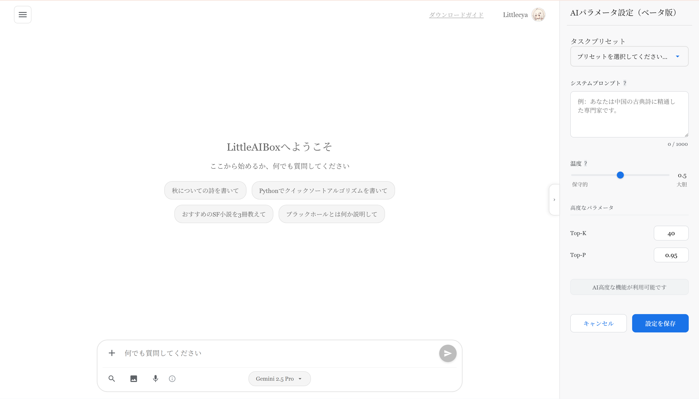
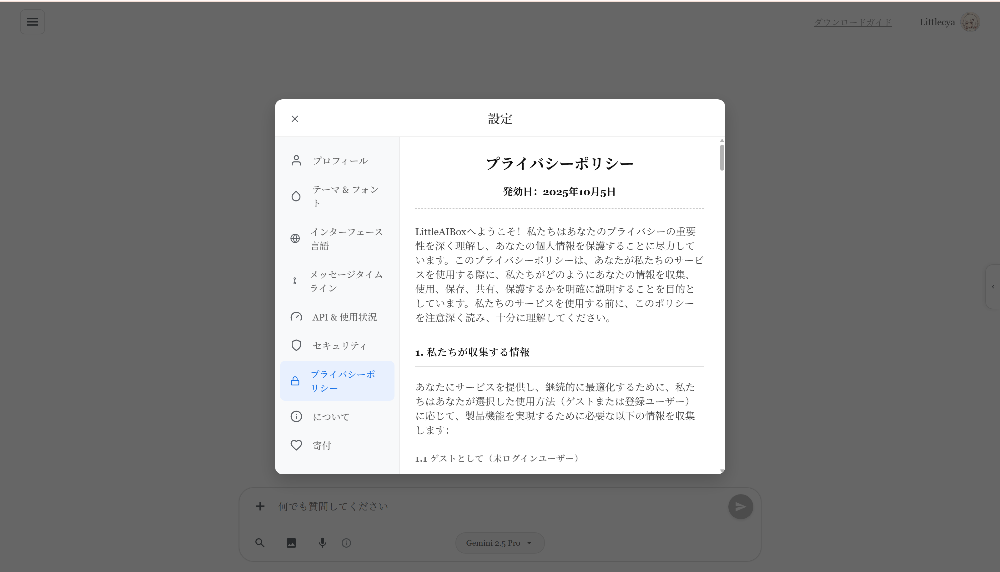
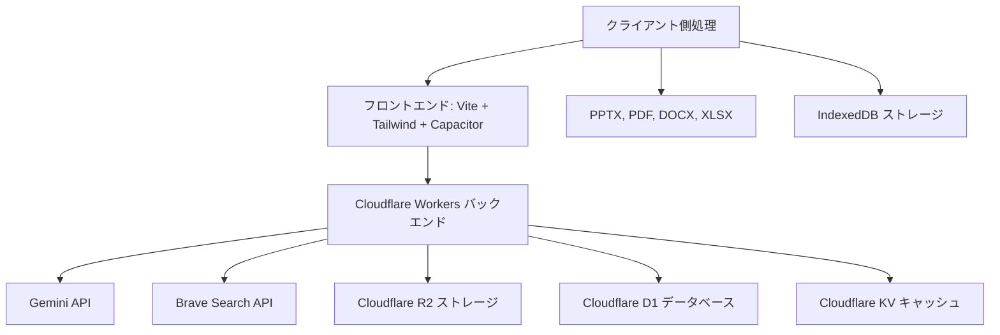

<div align="center">


# LittleAIBox

**モダンなクロスプラットフォーム AI 会話アシスタント**

[](https://opensource.org/licenses/MIT)
[](https://github.com/diandiancha/LittleAIBox)
[](https://github.com/diandiancha/LittleAIBox)

[中文](README.zh-CN.md) | [English](README.md) | [日本語](README.ja.md) | [한국어](README.ko.md)

このプロジェクトは、インテリジェントな AI 体験を提供するため、**Google Gemini API** を使用して会話機能を構築しています。

</div>

---

## 🎯 このプロジェクトの対象者

LittleAIBox は以下の方に最適です：

- **制限地域のユーザー**: Gemini との接続を簡単にする組み込みサービスリレーソリューション
- **学生と研究者**: ブラウザを離れることなく、論文、プレゼンテーション、文書を分析
- **開発者**: ファイルコンテキスト、コード説明、技術支援によるコーディングヘルプ
- **コンテンツクリエーター**: AI サポートによる Markdown コンテンツの生成と編集
- **プライバシー重視ユーザー**: すべての処理がローカルで実行され、データを完全にコントロール

---

### 🚀 ライブデモ

<div align="center">

**今すぐ試す:**  

[](https://ai.littletea.xyz)

</div>

### 💡 なぜ LittleAIBox を選ぶ？

**このプロジェクトの独自性：**

| 機能 | LittleAIBox | その他 |
|------|-------------|--------|
| ファイル処理 | 📄 PPTX、DOCX、PDF、XLSX サポート | 限定的またはサーバー側のみ |
| プライバシー | 🔒 クライアント側処理、アップロード不要 | しばしばファイルアップロードが必要 |
| オフラインサポート | 📱 完全な PWA、オフラインで動作 | 限られたオフライン機能 |
| クロスプラットフォーム | 🌐 Web + PWA + Android ネイティブ | 通常 Web またはモバイルのみ |
| フレームワーク | ⚡ Vanilla JS、ゼロ肥大化 | しばしば React/Vue の依存関係 |
| 地域アクセス | 🌍 組み込みサービスリレーソリューション | 地域的に制限される可能性 |
| オープンソース | ✅ 100% フロントエンドオープンソース | 様々 |
| コスト | 💰 独自の API キーを使用 | しばしばサブスクリプションベース |

**LittleAIBox を選択する理由**: 最大限のプライバシー、オフラインファースト設計、ゼロフレームワーク依存、AI 会話の完全なコントロール。

### 📱 アプリケーションスクリーンショット

#### メインページ



#### 設定ページ



---

## ✨ 主な機能

### 🎯 **スマートファイル処理**
- **Office ドキュメント**: Word (.docx)、PDF、Excel (.xlsx)、**PowerPoint (.pptx)** ファイルをブラウザ内で直接解析
- **リッチメディア**: 画像と Markdown ファイルをサポート
- **アップロード不要**: すべてのファイル処理がクライアント側で実行され、プライバシーを最大限に保護

### 🔐 **プライバシーファーストデザイン**
- **登録不要**: アカウントを作成せずにすぐに使用開始
- **自己設定 API キー**: 独自の Gemini API キーを使用し、データを完全にコントロール
- **柔軟なストレージ**: 登録ユーザーの API キーは永続化され、マルチデバイス同期に対応；ゲストユーザーのキーはローカルのみに保存され、ページ更新時に自動的にクリアされ、プライバシーを完全に保護します

### 🌍 **ユニバーサルアクセス**
- **地域制限の解決**: 地理的制限を回避する組み込みサービスリレールーティング
- **オフラインファースト**: オフライン機能を備えた完全な PWA サポート
- **クロスプラットフォーム**: Web、PWA、Android ネイティブアプリでシームレスに動作

### 💬 **高度な Markdown レンダリング**
- **コードハイライト**: 40+ のプログラミング言語をサポート
- **数式**: KaTeX による美しい数式レンダリング
- **図表**: インタラクティブな Mermaid 図表サポート
- **GitHub フレーバー**: シンタックスハイライト付きの完全な GFM サポート

### 🌐 **多言語サポート**
- **5 言語**: 中国語（簡体字/繁体字）、英語、日本語、韓国語
- **スマート検出**: ブラウザ設定に基づく自動言語検出
- **最適化された読み込み**: 即座の言語切り替えのためのインテリジェントな翻訳キャッシュ

### 🎨 **美しい UI/UX**
- **ダーク/ライトモード**: シームレスなテーマ切り替え
- **レスポンシブデザイン**: デスクトップ、タブレット、モバイルで完璧に動作
- **ネイティブ感**: Capacitor 統合により、ネイティブモバイル体験を実現

### ⚡ **パフォーマンス最適化**
- **高速読み込み**: コード分割を備えた Vite パワービルド
- **スマートキャッシュ**: インテリジェントなキャッシュ戦略を持つ Service Worker
- **軽量**: 純粋な JavaScript（重いフレームワークなし）

---

## 🏗️ アーキテクチャ

### 🏗️ システムアーキテクチャ図



### 🧩 フロントエンドスタック

**コア技術**
- **ビルドツール**: Vite 7.x
- **フレームワーク**: バニラ JavaScript (ES6+ Modules) - フレームワークオーバーヘッドゼロ
- **スタイリング**: Tailwind CSS 4.x
- **モバイル**: Capacitor 7.x (Android サポート)

**主要ライブラリ**
- **Markdown**: marked.js + DOMPurify
- **コードハイライト**: highlight.js (40+ 言語)
- **数式レンダリング**: KaTeX
- **チャート**: Mermaid
- **ファイル解析**: mammoth (Word)、PDF.js、xlsx、pptx2html
- **ストレージ**: IndexedDB + localStorage

### 💾 クライアント側処理

すべてのファイル解析と処理は完全にブラウザ内で実行されます：
- **PPTX パース**: PowerPoint コンテンツの完全抽出
- **PDF 読み取り**: テキストとメタデータの抽出
- **Excel 処理**: スプレッドシートデータの解析
- **画像処理**: クライアント側画像処理

### オフラインサポート

- **Service Worker**: カスタムキャッシュ戦略
- **IndexedDB**: ローカルチャット履歴と設定ストレージ
- **プログレッシブ Web アプリ**: インストール可能でオフラインで動作

### 🛡️ バックエンドアーキテクチャ

本プロジェクトのバックエンドは **Cloudflare Workers** 上に構築され、モダンなサーバーレスアーキテクチャを採用しています。

**なぜバックエンドはクローズドソースなのか？**

透明性に取り組んでいますが、バックエンドは以下の重要な理由によりクローズドソースとして維持されています：

1. **セキュリティ**: ユーザーデータ、API キー、認証メカニズムの保護
2. **コスト管理**: API キーの不正使用を防ぎ、持続可能なサービスコストを確保
3. **インフラストラクチャ**: 独自の最適化戦略とフェイルオーバーシステムの保護
4. **コンプライアンス**: 地域要件を満たしながらサービス品質を維持

**何が透明か？**

- ✅ すべてのフロントエンドコードはオープンソースで MIT ライセンス
- ✅ すべての API エンドポイントは公開され、よく文書化されています
- ✅ すべてのネットワークリクエストを検査できます
- ✅ クライアント側処理は完全に監査可能
- ✅ 隠れた追跡やデータ収集なし

**開発者向け**: フロントエンドコードはすべてのバックエンド相互作用を示しており、独自のバックエンドを構築するか、同じ API を使用してスタック全体を自己ホストできます。すべての API は公開され、安定しています。

#### コアデータベース層

**Cloudflare D1 (SQLite)**
- 完全なユーザー認証システム（メール/パスワード）、安全なパスワードハッシュと検証をサポート
- JWT セッション管理により、ステートレス認証とマルチデバイスログインを実現
- チャット履歴の永続化ストレージ、履歴のクエリと復元をサポート
- ユーザー設定と環境設定の管理

#### コア：弾性 API キープール (APIKeyPool)

このシステムには、プロダクションレベルの高可用 API キー管理システムが搭載されています：

- **マルチキーローテーション**: 複数の Gemini と Brave Search API キーをインテリジェントに管理し、自動ロードバランシングを実現
- **ヘルスチェックメカニズム**: 各キーの可用性と応答品質をリアルタイムで監視
- **自動フェイルオーバー**: キーが失敗またはレート制限に達した場合、バックアップキーにシームレスに切り替え
- **サーキットブレーカー保護**: 短時間内の失敗したキーへの繰り返しリクエストを防止し、システムリソースを保護
- **インテリジェントリトライ戦略**: 指数バックオフアルゴリズムにより、リクエスト成功率を最大化

#### コア：インテリジェントデグレードとフォールバックシステム (Smart Failover)

慎重に設計された4層のインテリジェントデグレードアーキテクチャを実装し、高可用性とサービス継続性を確保：

1. **ユーザーキー優先**: ユーザーが設定した API キーを優先的に使用
2. **ハイブリッドモード**: ユーザーキーをベースに、サーバーキーをインテリジェントに補完
3. **シングルキーモード**: 単一のサーバーキーをバックアップソリューションとして使用
4. **サーバーフォールバック**: 最終的な保障メカニズムにより、サービスが永続的に中断されることを防止

このシステムは、地域制限、無効なキー、ネットワーク障害などの問題を自動的に検出し、バイパスして、ユーザーに継続的で安定したサービス体験を提供します。

#### 統合サービスエコシステム

**メールサービス**
- **Resend**: 安全なメール検証とパスワードリセットフローに使用
- HTML テンプレートと国際化メールコンテンツをサポート

**検索とコンテンツ**
- **Brave Search API**: 高品質な Web 検索結果を提供し、AI コンテキスト理解を強化
- **GNews API**: 最新情報クエリをサポートするリアルタイムニュース統合

**画像生成**
- **pollinations.ai**: 複数のアーティスティックスタイルをサポートする高性能画像生成サービス
- ユーザープライバシーを保護するクライアント側プロキシサービス

**クラウドストレージ**
- **Cloudflare R2**: ユーザーアバターと添付ファイルのストレージ用 S3 互換オブジェクトストレージ
- グローバル CDN アクセラレーション、低遅延アクセス
- **Cloudflare KV**: キャッシュ、セッション管理、使用量制限追跡用の高性能キー値ストレージ

---

## 📁 プロジェクト構造

```
LittleAIBox/
├── src/                    # ソースコード
│   ├── main.js            # メインアプリケーションロジック
│   ├── api-config.js      # API 設定
│   ├── db.js              # IndexedDB ラッパー
│   ├── i18n.js            # 国際化
│   ├── mermaid-renderer.js # 図表レンダリング
│   ├── style.css          # グローバルスタイル
│   └── sw-custom.js       # Service Worker
├── public/                 # 静的アセット
│   ├── locales/           # 翻訳ファイル（5言語）
│   ├── libs/              # サードパーティライブラリ
│   ├── images/            # 画像とアイコン
│   └── manifest.webmanifest # PWA マニフェスト
├── appshow/                # 言語別スクリーンショット
├── capacitor.config.json   # モバイルアプリ設定
├── vite.config.js          # ビルド設定
└── package.json            # 依存関係
```

---

## 🚀 はじめに

### 📝 使用方法

**使用のヒント**: より良い体験のために、Gemini API キーを設定することをお勧めします。登録は不要で、設定ページで API キーを入力するだけで使用を開始できます。

API キーの取得：[Google AI Studio](https://aistudio.google.com/api-keys)

### 前提条件

- Node.js 18+
- npm または yarn
- Gemini API キー（オプション、最良の体験を得るために推奨）

> **注**: サービスは共有 API キーで動作しますが、より良いパフォーマンスとプライバシー保護のために独自の API キーを使用することを強く推奨します。

### インストール

```bash
# リポジトリをクローン
git clone https://github.com/diandiancha/LittleAIBox.git
cd LittleAIBox

# 依存関係をインストール
npm install

# 開発サーバーを起動
npm run dev

# 本番用にビルド
npm run build
```

### 設定

1. **API キーの取得**（まだお持ちでない場合）：
   - [Google AI Studio](https://aistudio.google.com/api-keys) にアクセス
   - 新しい API キーを作成
   - アプリケーションで使用するためにキーをコピー

2. **アプリでの設定**：
   - アプリを開く：[LittleAIBox](https://ai.littletea.xyz)
   - 設定ページに移動
   - Gemini API キーを入力
   - 保存してチャットを開始！

### トラブルシューティング

**一般的な問題：**

| 問題 | 解決策 |
|------|--------|
| API キーが機能しない | キーが Google AI Studio からのものであり、残りのクォータがあることを確認 |
| ファイルが解析されない | ブラウザコンソールのエラーを確認；ファイル形式がサポートされていることを確認 |
| 応答が遅い | ネットワーク接続を確認；独自の API キーの使用を検討 |
| モバイルビルドが失敗する | Android Studio がインストールされ、環境が正しく設定されていることを確認 |

**ヘルプが必要？**
- [Issues](https://github.com/diandiancha/LittleAIBox/issues) で既知の問題を確認
- 詳細を記載して新しい issue を開く

### モバイル向けビルド

```bash
# Android プラットフォームを追加
npx cap add android

# ファイルを同期
npx cap sync

# Android Studio で開く
npx cap open android
```

---

## 🤝 貢献

貢献をお待ちしています！バグ修正、機能追加、ドキュメント改善など、どのような貢献でも LittleAIBox をより良いものにします。

### 貢献方法

1. **リポジトリをフォーク**し、ローカルにクローン
2. **ブランチを作成**: `git checkout -b feature/your-feature-name`
3. **変更を行い**、十分にテスト
4. **変更をコミット**: `git commit -m "Add: 変更の説明"`
5. **フォークにプッシュ**: `git push origin feature/your-feature-name`
6. **Pull Request を開く**、変更の明確な説明と共に

### ガイドライン

- 既存のコードスタイルと規約に従う
- 複雑なロジックにコメントを追加
- 新機能のドキュメントを更新
- 明確なコミットメッセージを記述
- 提出前に変更をテスト

### ロードマップ

現在積極的に取り組んでいる機能：

- 🌐 iOS サポート（Capacitor）
- 📊 より多くのファイル形式サポート
- 🎨 カスタムテーマ
- 🔌 プラグインシステム
- 🌍 より多くの言語
- 📱 強化されたモバイル機能

アイデアがありますか？[Issue を開く](https://github.com/diandiancha/LittleAIBox/issues) またはディスカッションを開始してください！

---

## 🎯 ユースケース

- **学術研究**: 研究論文、プレゼンテーションの解析と分析
- **コンテンツ作成**: AI を使用した Markdown コンテンツの生成と編集
- **コードアシスタンス**: プログラミングタスクとコード説明のサポート
- **ドキュメント分析**: Office ドキュメントからの洞察抽出
- **学習ツール**: ファイル添付をサポートするインタラクティブな AI チュータリング

---

## 🔒 プライバシーとセキュリティ

- **クライアント側処理**: ファイル解析はブラウザ内で実行されます
- **ローカルストレージ**: チャット履歴はローカルに保存（オプションのクラウド同期）
- **トラッキングなし**: プライバシーファーストの設計
- **オープンソース**: 透明で監査可能なコード

🧠 **すべての処理はローカルまたは設定された API キーを通じて実行されます — 同意なくデータがデバイスから流出することはありません。**

---

## 📄 ライセンス

本プロジェクトは [MIT License](LICENSE) の下でライセンスされています。

Copyright (c) 2025 diandiancha

---

<div align="center">

Made with ❤️ by diandiancha

**役に立ったら ⭐ スターをお願いします！**

💬 **質問やフィードバック？[Issue を開く](https://github.com/diandiancha/LittleAIBox/issues) — すべて読んでいます！**

</div>
