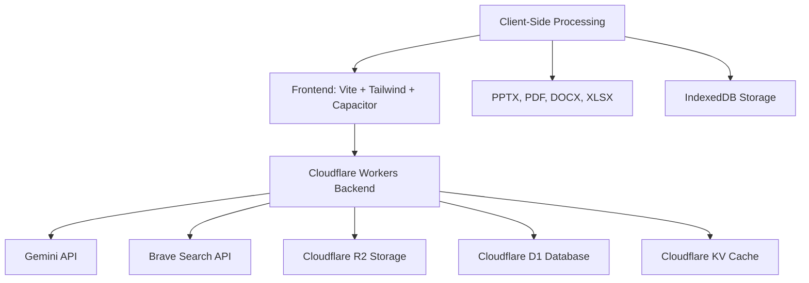

<div align="center">


# LittleAIBox

**A Modern, Cross-Platform AI Conversation Assistant**

[](https://opensource.org/licenses/MIT)
[](https://github.com/diandiancha/LittleAIBox)
[](https://github.com/diandiancha/LittleAIBox)

[中文](README.zh-CN.md) | [English](README.md) | [日本語](README.ja.md) | [한국어](README.ko.md)

This project is built using **Google Gemini API** for conversational AI interactions, providing an intelligent AI experience.

</div>

---

## 🎯 Who Is This For?

LittleAIBox is perfect for:

- **Users in Restricted Regions**: Built-in service relay solutions to easily connect you with Gemini
- **Students & Researchers**: Analyze papers, presentations, and documents without leaving your browser
- **Developers**: Get coding help with file context, code explanations, and technical assistance
- **Content Creators**: Generate and edit markdown content with AI support
- **Privacy-Conscious Users**: All processing happens locally; you control your data

---

### 🚀 Live Demo

<div align="center">

🚀 **Try it now:**  

[](https://ai.littletea.xyz)

</div>

### 💡 Why LittleAIBox?

**What makes this project different?**

| Feature | LittleAIBox | Others |
|---------|-------------|--------|
| File Processing | 📄 PPTX, DOCX, PDF, XLSX support | Limited or server-side only |
| Privacy | 🔒 Client-side processing, no uploads | Often requires file uploads |
| Offline Support | 📱 Full PWA, works offline | Limited offline capabilities |
| Cross-Platform | 🌐 Web + PWA + Android native | Usually web or mobile only |
| Framework | ⚡ Vanilla JS, zero bloat | Often React/Vue dependencies |
| Regional Access | 🌍 Built-in service relay solution | May be regionally restricted |
| Open Source | ✅ 100% frontend open-source | Varies |
| Cost | 💰 Use your own API key | Often subscription-based |

**Choose LittleAIBox if you want**: Maximum privacy, offline-first design, zero framework dependencies, and complete control over your AI conversations.

### 📱 Application Screenshots

#### Main Page


#### Settings Page


---

## ✨ Key Features

### 🎯 **Smart File Processing**
- **Office Documents**: Parse Word (.docx), PDF, Excel (.xlsx), and **PowerPoint (.pptx)** files directly in the browser
- **Rich Media**: Support for images and Markdown files
- **Zero Upload Required**: All file processing happens client-side for maximum privacy

### 🔐 **Privacy-First Design**
- **No Registration Required**: Start using immediately without creating an account
- **Self-Configure API Key**: Use your own Gemini API key, with complete data control
- **Flexible Storage**: Registered users' API keys are persisted for multi-device sync; guest users' keys are stored locally only and automatically cleared on page refresh, ensuring privacy

### 🌍 **Universal Access**
- **Regional Restriction Solution**: Built-in service relay routing to bypass geographical limitations
- **Offline-First**: Full PWA support with offline capabilities
- **Cross-Platform**: Works seamlessly on Web, PWA, and Android native apps

### 💬 **Advanced Markdown Rendering**
- **Code Highlighting**: Support for 40+ programming languages
- **Mathematical Expressions**: Beautiful math rendering with KaTeX
- **Diagrams**: Interactive Mermaid diagram support
- **GitHub Flavored Markdown**: Full GFM support with syntax highlighting

### 🌐 **Multi-Language Support**
- **5 Languages**: Chinese (Simplified/Traditional), English, Japanese, Korean
- **Smart Detection**: Automatic language detection based on browser settings
- **Optimized Loading**: Intelligent translation caching for instant language switching

### 🎨 **Beautiful UI/UX**
- **Dark/Light Mode**: Seamless theme switching
- **Responsive Design**: Perfect on desktop, tablet, and mobile
- **Native Feel**: Capacitor integration for native mobile experience

### ⚡ **Performance Optimized**
- **Fast Loading**: Vite-powered build with code splitting
- **Smart Caching**: Service Worker with intelligent cache strategies
- **Lightweight**: Pure JavaScript (no heavy frameworks)

---

## 🏗️ Architecture

### 🏗️ System Diagram



### 🧩 Frontend Stack

**Core Technologies**
- **Build Tool**: Vite 7.x
- **Framework**: Vanilla JavaScript (ES6+ Modules) - Zero framework overhead
- **Styling**: Tailwind CSS 4.x
- **Mobile**: Capacitor 7.x (Android support)

**Key Libraries**
- **Markdown**: marked.js + DOMPurify
- **Code Highlighting**: highlight.js (40+ languages)
- **Math Rendering**: KaTeX
- **Charts**: Mermaid
- **File Parsing**: mammoth (Word), PDF.js, xlsx, pptx2html
- **Storage**: IndexedDB + localStorage

### 💾 Client-Side Processing

All file parsing and processing happens entirely in the browser:
- **PPTX Parsing**: Full PowerPoint content extraction
- **PDF Reading**: Text and metadata extraction
- **Excel Processing**: Spreadsheet data parsing
- **Image Handling**: Client-side image processing

### Offline Support

- **Service Worker**: Custom caching strategies
- **IndexedDB**: Local chat history and settings storage
- **Progressive Web App**: Installable and works offline

### 🛡️ Backend Architecture

The project's backend is built on **Cloudflare Workers**, leveraging a modern serverless architecture. 

**Why is the backend closed-source?**

While I'm committed to transparency, the backend remains closed-source for several important reasons:

1. **Security**: Protecting user data, API keys, and authentication mechanisms
2. **Cost Control**: Preventing API key abuse and ensuring sustainable service costs
3. **Infrastructure**: Safeguarding proprietary optimization strategies and failover systems
4. **Compliance**: Meeting regional requirements while maintaining service quality

**What's transparent?**

- ✅ All frontend code is open-source and MIT licensed
- ✅ All API endpoints are public and well-documented
- ✅ You can inspect all network requests
- ✅ Client-side processing is fully auditable
- ✅ No hidden tracking or data collection

**For developers:** The frontend code demonstrates all backend interactions, and you can build your own backend or self-host the entire stack. All APIs are public and stable.

#### Core Database Layer

**Cloudflare D1 (SQLite)**
- Complete user authentication system (email/password) with secure password hashing and verification
- JWT session management for stateless authentication and multi-device login
- Chat history persistence with query and recovery support
- User configuration and preference management

#### Core: Elastic API Key Pool (APIKeyPool)

This system features a production-grade, highly available API key management system:

- **Multi-Key Rotation**: Intelligent management of multiple Gemini and Brave Search API keys with automatic load balancing
- **Health Check Mechanism**: Real-time monitoring of each key's availability and response quality
- **Automatic Failover**: Seamless switch to backup keys when a key fails or hits rate limits
- **Circuit Breaker Protection**: Prevents repeated requests to failed keys, protecting system resources
- **Intelligent Retry Strategy**: Exponential backoff algorithm to maximize request success rates

#### Core: Smart Failover & Degradation System

Implemented a carefully designed four-tier intelligent degradation architecture, ensuring high availability and service continuity:

1. **User Key Priority**: Prioritizes user-configured API keys
2. **Hybrid Mode**: Intelligently supplements with server keys when needed
3. **Single Key Mode**: Server key as backup solution
4. **Server Fallback**: Final safeguard ensuring service continuity

The system automatically detects and bypasses regional restrictions, invalid keys, network failures, and other issues, providing users with consistent and stable service.

#### Integrated Service Ecosystem

**Email Services**
- **Resend**: For secure email verification and password reset flows
- Supports HTML templates and internationalized email content

**Search & Content**
- **Brave Search API**: High-quality web search results to enhance AI context understanding
- **GNews API**: Real-time news integration for latest information queries

**Image Generation**
- **pollinations.ai**: High-performance image generation service supporting multiple artistic styles
- Client-side proxy service for user privacy protection

**Cloud Storage**
- **Cloudflare R2**: S3-compatible object storage for user avatars and attachments
- Global CDN acceleration with low-latency access
- **Cloudflare KV**: High-performance key-value storage for caching, session management, and usage limit tracking

---

## 📁 Project Structure

```
LittleAIBox/
├── src/                    # Source code
│   ├── main.js            # Main application logic
│   ├── api-config.js      # API configuration
│   ├── db.js              # IndexedDB wrapper
│   ├── i18n.js            # Internationalization
│   ├── mermaid-renderer.js # Diagram rendering
│   ├── style.css          # Global styles
│   └── sw-custom.js       # Service Worker
├── public/                 # Static assets
│   ├── locales/           # Translation files (5 languages)
│   ├── libs/              # Third-party libraries
│   ├── images/            # Images and icons
│   └── manifest.webmanifest # PWA manifest
├── appshow/                # Screenshots by language
├── capacitor.config.json   # Mobile app configuration
├── vite.config.js          # Build configuration
└── package.json            # Dependencies
```

---

## 🚀 Getting Started

### 📝 Usage Note

**Usage Note**: We recommend configuring your own Gemini API key for the best experience. No registration needed - simply enter your API key in the settings page to get started.

Get API Key: [Google AI Studio](https://aistudio.google.com/api-keys)

### Prerequisites

- Node.js 18+ 
- npm or yarn
- A Gemini API key (optional, but recommended for best experience)

> **Note**: While the service can work with shared API keys, we strongly recommend using your own API key for better performance and privacy.

### Installation

```bash
# Clone the repository
git clone https://github.com/diandiancha/LittleAIBox.git
cd LittleAIBox

# Install dependencies
npm install

# Start development server
npm run dev

# Build for production
npm run build
```

### Configuration

1. **Get Your API Key** (if you don't have one):
   - Visit [Google AI Studio](https://aistudio.google.com/api-keys)
   - Create a new API key
   - Copy the key for use in the app

2. **Configure in App**:
   - Open the app: [LittleAIBox](https://ai.littletea.xyz)
   - Go to Settings
   - Enter your Gemini API key
   - Save and start chatting!

### Troubleshooting

**Common Issues:**

| Issue | Solution |
|-------|----------|
| API Key not working | Ensure your key is from Google AI Studio and has quota remaining |
| Files not parsing | Check browser console for errors; ensure file format is supported |
| Slow responses | Check your network connection; consider using your own API key |
| Mobile build fails | Ensure Android Studio is installed and environment is set up correctly |

**Need Help?**
- Check [Issues](https://github.com/diandiancha/LittleAIBox/issues) for known problems
- Open a new issue with your problem details

### Building for Mobile

```bash
# Add Android platform
npx cap add android

# Sync files
npx cap sync

# Open in Android Studio
npx cap open android
```

---

## 🎯 Use Cases

- **Academic Research**: Parse and analyze research papers, presentations
- **Content Creation**: Generate and edit markdown content with AI
- **Code Assistance**: Get help with programming tasks and code explanations
- **Document Analysis**: Extract insights from Office documents
- **Learning Tool**: Interactive AI tutoring with file attachments

---

## 🤝 Contributing

We welcome contributions! Whether you're fixing bugs, adding features, or improving documentation, every contribution makes LittleAIBox better.

### How to Contribute

1. **Fork the repository** and clone it locally
2. **Create a branch**: `git checkout -b feature/your-feature-name`
3. **Make your changes** and test them thoroughly
4. **Commit your changes**: `git commit -m "Add: description of your changes"`
5. **Push to your fork**: `git push origin feature/your-feature-name`
6. **Open a Pull Request** with a clear description of your changes

### Guidelines

- Follow existing code style and conventions
- Add comments for complex logic
- Update documentation for new features
- Write clear commit messages
- Test your changes before submitting

### Roadmap

I'm actively working on:

- 🌐 iOS support (Capacitor)
- 📊 More file format support
- 🎨 Custom themes
- 🔌 Plugin system
- 🌍 More languages
- 📱 Enhanced mobile features

Have ideas? [Open an issue](https://github.com/diandiancha/LittleAIBox/issues) or start a discussion!

---

## 🔒 Privacy & Security

- **Client-Side Processing**: File parsing happens in your browser
- **Local Storage**: Chat history stored locally (optional cloud sync)
- **No Tracking**: Privacy-first design
- **Open Source**: Transparent and auditable code

🧠 **All processing happens locally or through your configured API key — no data ever leaves your device without your consent.**

---

## 📄 License

This project is licensed under the [MIT License](LICENSE).

Copyright (c) 2025 diandiancha

---

<div align="center">

Made with ❤️ by diandiancha

**Star ⭐ this repo if you find it helpful!**

💬 **Questions or feedback? [Open an issue](https://github.com/diandiancha/LittleAIBox/issues) — I read every one of them!**

</div>
