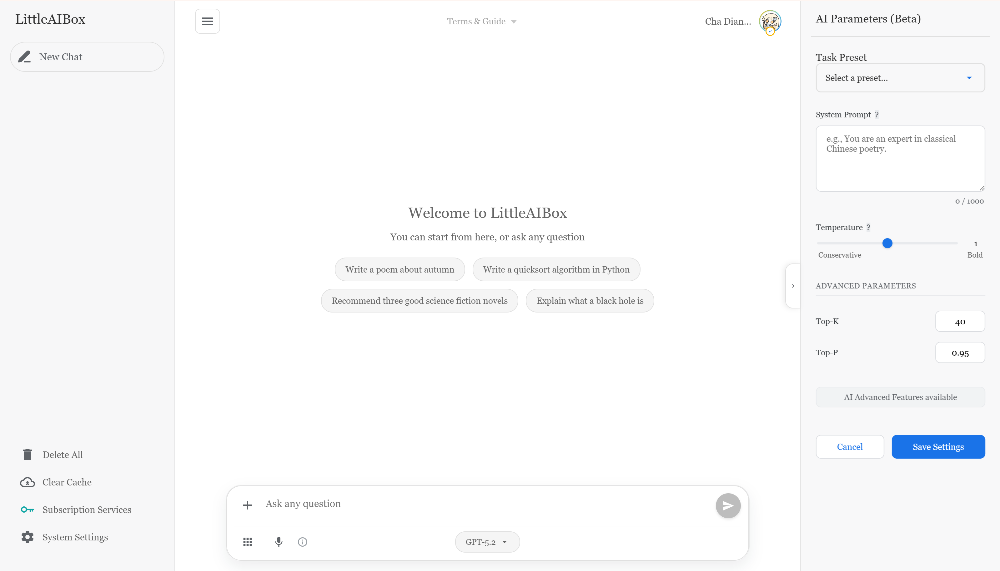
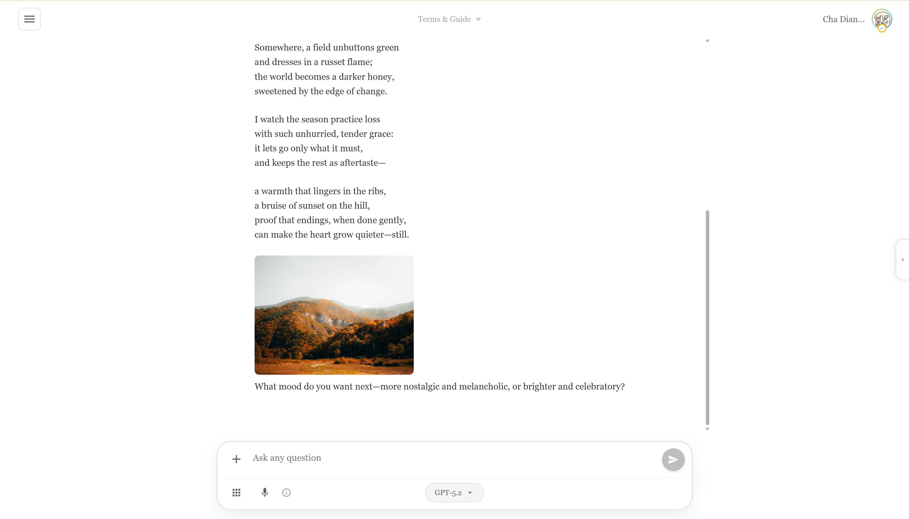
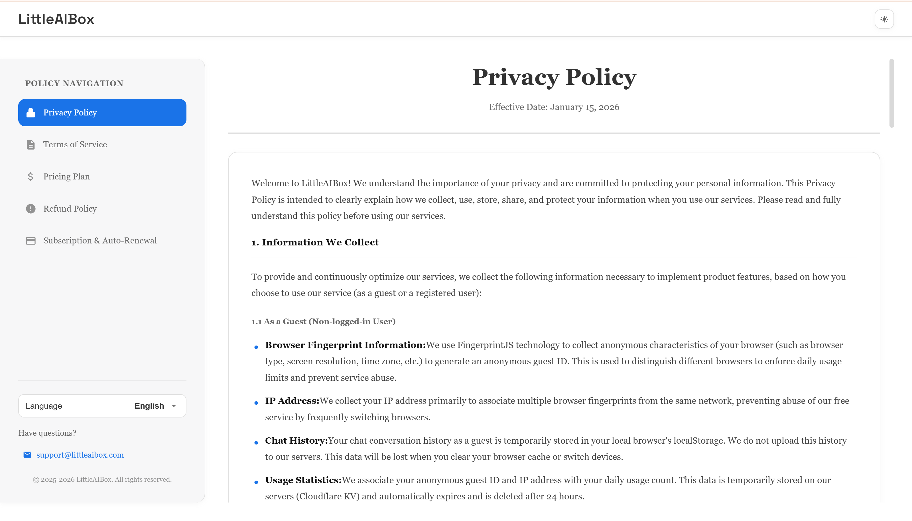
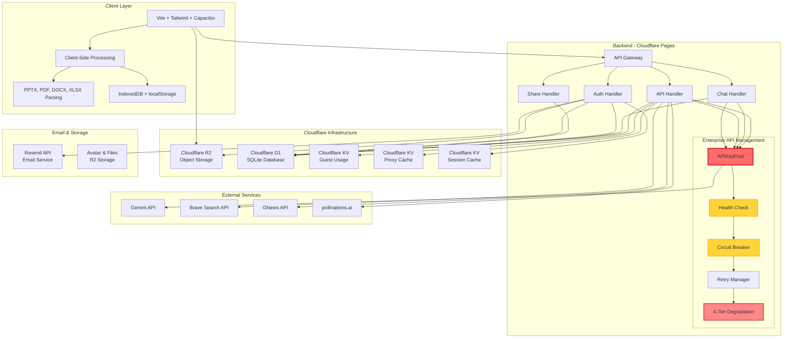

<div align="center">


# LittleAIBox

**A Modern, Cross-Platform AI Conversation Assistant**

[](https://opensource.org/licenses/MIT)
[](https://github.com/diandiancha/LittleAIBox)
[](https://github.com/diandiancha/LittleAIBox)
[](https://www.producthunt.com/products/littleaibox)

[中文](docs/README.zh-CN.md) | [English](README.md) | [日本語](docs/README.ja.md) | [한국어](docs/README.ko.md) | [Español](docs/README.es.md) | [Français](docs/README.fr.md)

This project is built using **Google Gemini API** for conversational AI interactions, providing an intelligent AI experience.

</div>

---

> 🎓 This project is developed for educational and research purposes.  

> 💼 Commercial deployments and premium services are operated separately by the author to ensure security and sustainability.

---

## 🎯 Who Is This For?

LittleAIBox is perfect for:

- **Users in Restricted Regions**: Built-in service relay solutions to easily connect you with Gemini
- **Students & Researchers**: Analyze papers, presentations, and documents without leaving your browser
- **Developers**: Get coding help with file context, code explanations, and technical assistance
- **Content Creators**: Generate and edit markdown content with AI support
- **Privacy-Conscious Users**: All processing happens locally; you control your data

---

### 🚀 Live Demo

<div align="center">

**Try it now:**  

[](https://littleaibox.com)

</div>

### 💡 Why LittleAIBox?

**What makes this project different?**

| Feature | LittleAIBox | Others |
|---------|-------------|--------|
| File Processing | 📄 PPTX, DOCX, PDF, XLSX support | Limited or server-side only |
| Privacy | 🔒 Client-side processing, no uploads | Often requires file uploads |
| Offline Support | 📱 Full PWA, works offline | Limited offline capabilities |
| Cross-Platform | 🌐 Web + PWA + Android native | Usually web or mobile only |
| Framework | ⚡ Vanilla JS, zero bloat | Often React/Vue dependencies |
| Regional Access | 🌍 Built-in service relay solution | May be regionally restricted |
| **High Availability** | 🛡️ **Enterprise-grade API pool** with health checks & auto-failover | ❌ Single API dependency, prone to failure |
| Open Source | ✅ 100% frontend open-source | Varies |
| Cost | 💰 Use your own API key | Often subscription-based |

**Choose LittleAIBox if you want**: Maximum privacy, offline-first design, zero framework dependencies, and complete control over your AI conversations.

### 🌟 Official Description

> **Private, Global AI Chat & Integration Platform**
>
> LittleAIBox is a full-stack, cross-platform Gemini AI chat application (built with Vite/Capacitor/Cloudflare) featuring an intelligent API pooling and proxy backend that bypasses regional restrictions for stable global access. Key features include:
>
> - Client-side parsing (PDF/DOCX/PPTX support)
> - Mermaid/LaTeX/Vega-Lite rendering with chart export
> - Real-time web search & Semantic Scholar research mode
> - Conversation timeline navigation
> - Dual API key management with intelligent load balancing
> - Customizable AI parameters and task presets
> - Voice input support
>
> Unlike traditional AI applications, LittleAIBox runs locally, ensuring your files and messages never leave your device. It emphasizes privacy with intelligent API key rotation, provides stable global access, and allows custom AI parameters to optimize your chat experience. Users can optionally register for cloud sync, but the platform works fully without an account and doesn't expose your location or request origin. LittleAIBox is open-source, lightweight, and designed for users who value privacy, control, and freedom.
>
> *[View on Product Hunt →](https://www.producthunt.com/products/littleaibox)*

### 📱 Application Screenshots

#### Main Page



#### Example Output Page



#### Privacy Page



---

## ✨ Key Features

### 🎯 **Smart File Processing**
- **Office Documents**: Parse Word (.docx), PDF, Excel (.xlsx, .xls, .csv), and **PowerPoint (.pptx)** files directly in the browser
- **Rich Media**: Support for images and Markdown files
- **Plain Text Files**: Support for various text file formats
- **File Viewer**: Built-in file viewer with syntax highlighting for code files, image preview, and rich text rendering
- **Zero Upload Required**: All file processing happens client-side for maximum privacy

### 🔐 **Privacy-First Design**
- **No Registration Required**: Start using immediately without creating an account
- **Multiple Login Options**: Email/password, OAuth (Google, GitHub), or guest mode
- **Multi-Factor Authentication (MFA)**: Optional TOTP authenticator app support with backup codes
- **Dual API Key Management**: Configure two API keys with intelligent mixed mode (load balancing) or single mode (backup fallback)
- **Self-Configure API Key**: Use your own Gemini API key, with complete data control
- **Flexible Storage**: Registered users' API keys are persisted for multi-device sync; guest users' keys are stored locally only and automatically cleared on page refresh, ensuring privacy
- **Password Management**: Secure password reset via email verification
- **Custom Avatar**: Upload and manage your profile avatar

### 🌍 **Universal Access**
- **Regional Restriction Solution**: Built-in service relay routing to bypass geographical limitations
- **Offline-First**: Full PWA support with offline capabilities
- **Cross-Platform**: Works seamlessly on Web, PWA, and Android native apps

### 💬 **Advanced Markdown Rendering**
- **Code Highlighting**: Support for 40+ programming languages
- **Mathematical Expressions**: Beautiful math rendering with KaTeX
- **Diagrams**: Interactive Mermaid diagram support with PNG/SVG export
- **Data Visualization**: Vega-Lite chart rendering with interactive charts and PNG export
- **Mindmap Rendering**: Markmap-based mindmap rendering and preview for structured markdown content
- **Chart Export**: Download generated charts (Mermaid diagrams and Vega-Lite visualizations) as PNG or SVG files
- **GitHub Flavored Markdown**: Full GFM support with syntax highlighting

### 🛠️ **Advanced AI Features**
- **Multiple Interaction Modes**: 
  - **Search Mode**: Real-time web search integration for up-to-date information
  - **Research Mode**: Academic research powered by Semantic Scholar API - automatically searches and cites relevant academic papers, structures responses with Abstract/Introduction/Methods/Results/Discussion/Conclusion format, and provides in-text citations [1], [2]...
  - **Image Generation Mode**: AI-powered image creation
- **Voice Input**: Speech-to-text input support (best on Chrome desktop)
- **Custom AI Parameters**: Fine-tune AI behavior with:
  - System prompts for role customization
  - Temperature control (creativity vs. consistency)
  - Advanced parameters (topK, topP)
  - Task presets (coding assistant, writing assistant, translation, classical Chinese research, travel guide, roleplay creative)

### 🧾 **Productivity Export**
- **Multi-format Export**: Export chat/content to DOCX, PDF, PPTX, and XLSX
- **Content Preservation**: Keep headings, lists, code blocks, formulas, tables, diagrams, and images

### 🔗 **Bridge Session Collaboration**
- **Parent-Child Context Bridge**: Continue conversations with inherited context from source chats

### 📲 **Native Update Experience**
- **APK Update Check**: Detect newer APK versions and fallback to download page when needed

### 📌 **Open-Source Scope**
- **Frontend-Only Package**: This repository ships the open-source frontend; subscription/payment backends are omitted

### 🌐 **Multi-Language Support**
- **6 Languages**: Chinese (Simplified/Traditional), English, Japanese, Korean, Spanish, French
- **Smart Detection**: Automatic language detection based on browser settings
- **Optimized Loading**: Intelligent translation caching for instant language switching

### 🎨 **Beautiful UI/UX**
- **Dark/Light Mode**: Seamless theme switching
- **Custom Fonts**: Choose from system default, serif, monospace, or elegant cursive fonts
- **Responsive Design**: Perfect on desktop, tablet, and mobile
- **Native Feel**: Capacitor integration for native mobile experience
- **Conversation Timeline**: Floating timeline navigation for quick access to assistant messages

### ⚡ **Performance Optimized**
- **Fast Loading**: Vite-powered build with code splitting
- **Smart Caching**: Service Worker with intelligent cache strategies
- **Lightweight**: Pure JavaScript (no heavy frameworks)

### 🛡️ **Enterprise-Grade Backend Architecture**
- **Elastic API Key Pool**: Production-grade multi-key rotation with automatic load balancing
- **Health Check & Circuit Breaker**: Real-time monitoring and intelligent failover protection
- **4-Tier Smart Degradation**: Seamless service continuity even under failures
- **High Availability**: Guaranteed uptime with automatic regional restriction bypass

---

## 🏗️ Architecture

### 🏗️ System Diagram


```mermaid
graph TB
    subgraph "Client Layer"
        A[Vite + Tailwind + Capacitor]
        H[Client-Side Processing]
        I[PPTX, PDF, DOCX, XLSX Parsing]
        J[IndexedDB + localStorage]
        A --> H
        H --> I
        H --> J
    end
    
    subgraph "Backend - Cloudflare Pages"
        B[API Gateway]
        B1[Auth Handler]
        B2[Chat Handler]
        B3[API Handler]
        B4[Share Handler]
        B --> B1
        B --> B2
        B --> B3
        B --> B4
        
        subgraph "Enterprise API Management"
            B5[APIKeyPool]
            B6[Health Check]
            B7[Circuit Breaker]
            B8[Retry Manager]
            B9[4-Tier Degradation]
            B5 --> B6
            B6 --> B7
            B7 --> B8
            B8 --> B9
        end
        
        B2 --> B5
        B3 --> B5
    end
    
    subgraph "External Services"
        C[Gemini API]
        D[Brave Search API]
        D1[GNews API]
        D2[pollinations.ai]
    end
    
    subgraph "Cloudflare Infrastructure"
        E[Cloudflare R2<br/>Object Storage]
        F[Cloudflare D1<br/>SQLite Database]
        G1[Cloudflare KV<br/>Guest Usage]
        G2[Cloudflare KV<br/>Proxy Cache]
        G3[Cloudflare KV<br/>Session Cache]
    end
    
    subgraph "Email & Storage"
        K[Resend API<br/>Email Service]
        L[Avatar & Files<br/>R2 Storage]
    end
    
    A --> B
    B1 --> F
    B2 --> B5
    B3 --> B5
    B4 --> F
    
    B5 --> C
    B3 --> D
    B3 --> D1
    B3 --> D2
    
    B1 --> F
    B2 --> F
    B3 --> F
    B1 --> G3
    B3 --> G1
    B3 --> G2
    
    B1 --> K
    B1 --> E
    A --> E
    
    style B5 fill:#ff6b6b,stroke:#c92a2a,stroke-width:3px
    style B9 fill:#ff8787,stroke:#c92a2a,stroke-width:2px
    style B6 fill:#ffd43b,stroke:#fab005,stroke-width:2px
    style B7 fill:#ffd43b,stroke:#fab005,stroke-width:2px
```

### 🧩 Frontend Stack

**Core Technologies**
- **Build Tool**: Vite 7.x
- **Framework**: Vanilla JavaScript (ES6+ Modules) - Zero framework overhead
- **Styling**: Tailwind CSS 4.x
- **Mobile**: Capacitor 7.x (Android support)

**Key Libraries**
- **Markdown**: marked.js + DOMPurify
- **Code Highlighting**: highlight.js (40+ languages)
- **Math Rendering**: KaTeX
- **Charts**: Mermaid, Vega-Lite
- **File Parsing**: mammoth (Word), PDF.js, xlsx, pptx2html
- **Speech Recognition**: Web Speech API
- **Storage**: IndexedDB + localStorage
- **Authentication**: JWT-based auth with OAuth 2.0 support (Google, GitHub)
- **Security**: MFA/TOTP support with backup codes

### 💾 Client-Side Processing

All file parsing and processing happens entirely in the browser:
- **PPTX Parsing**: Full PowerPoint content extraction
- **PDF Reading**: Text and metadata extraction
- **Excel Processing**: Spreadsheet data parsing (.xlsx, .xls, .csv)
- **Word Documents**: DOCX file parsing with formatting preservation
- **Image Handling**: Client-side image processing and base64 encoding

### Offline Support

- **Service Worker**: Custom caching strategies
- **IndexedDB**: Local chat history and settings storage
- **Progressive Web App**: Installable and works offline

### 🛡️ Backend Architecture

The project's backend is built on **Cloudflare Pages**, leveraging a modern serverless architecture. 

**Why is the backend closed-source?**

While I'm committed to transparency, the backend remains closed-source for several important reasons:

1. **Security**: Protecting user data, API keys, and authentication mechanisms
2. **Cost Control**: Preventing API key abuse and ensuring sustainable service costs
3. **Infrastructure**: Safeguarding proprietary optimization strategies and failover systems
4. **Compliance**: Meeting regional requirements while maintaining service quality

**What's transparent?**

- ✅ All frontend code is open-source and MIT licensed
- ✅ All API endpoints are public and well-documented
- ✅ You can inspect all network requests
- ✅ Client-side processing is fully auditable
- ✅ No hidden tracking or data collection

**For developers:** The frontend code demonstrates all backend interactions, and you can build your own backend or self-host the entire stack. All APIs are public and stable.

#### Core Database Layer

**Cloudflare D1 (SQLite)**
- Complete user authentication system with multiple login methods:
  - Email/password with secure bcrypt hashing
  - OAuth 2.0 integration (Google, GitHub)
  - Guest mode for anonymous usage
- Multi-Factor Authentication (MFA) support:
  - TOTP authenticator app integration
  - Backup code generation and management
- JWT session management for stateless authentication and multi-device login
- Password reset flow with email verification
- Chat history persistence with query and recovery support
- User configuration and preference management

#### Core: Elastic API Key Pool (APIKeyPool)

This system features a production-grade, highly available API key management system:

- **Multi-Key Rotation**: Intelligent management of multiple Gemini and Brave Search API keys with automatic load balancing
- **Health Check Mechanism**: Real-time monitoring of each key's availability and response quality
- **Automatic Failover**: Seamless switch to backup keys when a key fails or hits rate limits
- **Circuit Breaker Protection**: Prevents repeated requests to failed keys, protecting system resources
- **Intelligent Retry Strategy**: Exponential backoff algorithm to maximize request success rates

#### Core: Smart Failover & Degradation System

Implemented a carefully designed four-tier intelligent degradation architecture, ensuring high availability and service continuity:

1. **User Key Priority**: Prioritizes user-configured API keys
2. **Hybrid Mode**: Intelligently supplements with server keys when needed
3. **Single Key Mode**: Server key as backup solution
4. **Server Fallback**: Final safeguard ensuring service continuity

The system automatically detects and bypasses regional restrictions, invalid keys, network failures, and other issues, providing users with consistent and stable service.

#### Integrated Service Ecosystem

**Email Services**
- **Resend**: For secure email verification and password reset flows
- Supports HTML templates and internationalized email content
- Email-based account recovery and verification

**Search & Content**
- **Brave Search API**: High-quality web search results to enhance AI context understanding
- **GNews API**: Real-time news integration for latest information queries

**Image Generation**
- **pollinations.ai**: High-performance image generation service supporting multiple artistic styles
- Client-side proxy service for user privacy protection

**Cloud Storage**
- **Cloudflare R2**: S3-compatible object storage for user avatars and attachments
- Global CDN acceleration with low-latency access
- **Cloudflare KV**: High-performance key-value storage for caching, session management, and usage limit tracking

---

## 📚 Documentation

<div align="center">

**Quick Navigation to Project Resources**

[](LEARN.md) 
[](CONTRIBUTING.md) 
[](.github/CODE_OF_CONDUCT.md) 
[](.github/SECURITY.md)

**📖 [Full Documentation Index](docs/)**

</div>

---

## 📁 Project Structure

```
LittleAIBox/
├── src/                         # Frontend source
│   ├── main.js                  # Main app entry
│   ├── api-config.js            # API/runtime config
│   ├── apk-update-manager.js    # Native APK update flow
│   ├── entitlements.js          # Plan/limit capability gating
│   ├── mindmap-mode.js          # Mindmap mode runtime
│   ├── stream-image-runtime.js  # Stream image handling
│   ├── sync-queue.js            # Offline retry/sync queue
│   ├── router.js                # Client-side routing
│   ├── sw-custom.js             # Service worker logic
│   ├── auth/                    # Auth modules (OAuth/MFA/UI)
│   ├── bridge/                  # Bridge session modules
│   ├── file-parsers/            # Upload/file parsing pipeline
│   ├── file-export/             # DOCX/PDF/PPTX/XLSX export
│   ├── rendering/               # Mermaid/Vega render adapters
│   └── floating-timeline/       # Timeline feature modules
├── public/                      # Static assets
│   ├── locales/                 # i18n dictionaries
│   ├── libs/                    # Browser-side third-party libs
│   ├── images/                  # Icons/images/pwa assets
│   ├── policy/                  # Policy/legal pages
│   ├── subscribe/               # Subscription placeholder pages
│   ├── promocode/               # Promo placeholder pages
│   ├── shared/                  # Shared web modules
│   ├── workers/                 # Web workers
│   ├── download-app/            # APK download landing page
│   └── downloads/               # APK file index
├── scripts/                     # Build/dev helper scripts
├── appshow/                     # Screenshot assets by language
├── docs/                        # Multi-language documentation
├── capacitor.config.json        # Mobile app config
├── vite.config.js               # Vite build config
├── tailwind.config.js           # Tailwind config
└── package.json                 # Dependencies/scripts
```

---

## 🚀 Getting Started

### 📝 Usage Note

**Usage Note**: We recommend configuring your own Gemini API key for the best experience. No registration needed - simply enter your API key in the settings page to get started.

Get API Key: [Google AI Studio](https://aistudio.google.com/api-keys)

### Prerequisites

- Node.js 18+ 
- npm or yarn
- A Gemini API key (optional, but recommended for best experience)

> **Note**: While the service can work with shared API keys, we strongly recommend using your own API key for better performance and privacy.

### Installation

```bash
# Clone the repository
git clone https://github.com/diandiancha/LittleAIBox.git
cd LittleAIBox

# Install dependencies
npm install

# Start development server
npm run dev

# Build for production
npm run build
```

### Configuration

1. **Get Your API Key** (if you don't have one):
   - Visit [Google AI Studio](https://aistudio.google.com/api-keys)
   - Create a new API key
   - Copy the key for use in the app

2. **Configure in App**:
   - Open the app: [LittleAIBox](https://littleaibox.com)
   - Go to Settings
   - Enter your Gemini API key
   - Save and start chatting!

3. **Account Options** (Optional):
   - **Create Account**: Register with email/password or use OAuth (Google/GitHub)
   - **Enable MFA**: Go to Settings → Security to set up TOTP authenticator
   - **Guest Mode**: Use without registration (API keys stored locally only)

### Troubleshooting

**Common Issues:**

| Issue | Solution |
|-------|----------|
| API Key not working | Ensure your key is from Google AI Studio and has quota remaining |
| Files not parsing | Check browser console for errors; ensure file format is supported |
| Slow responses | Check your network connection; consider using your own API key |
| Mobile build fails | Ensure Android Studio is installed and environment is set up correctly |

**Need Help?**
- Check [Issues](https://github.com/diandiancha/LittleAIBox/issues) for known problems
- Open a new issue with your problem details

### Building for Mobile

```bash
# Add Android platform
npx cap add android

# Sync files
npx cap sync

# Open in Android Studio
npx cap open android
```

---

## 🎯 Use Cases

- **Academic Research**: Parse and analyze research papers, presentations
- **Content Creation**: Generate and edit markdown content with AI
- **Code Assistance**: Get help with programming tasks and code explanations
- **Document Analysis**: Extract insights from Office documents
- **Learning Tool**: Interactive AI tutoring with file attachments

---

## 🤝 Contributing

I welcome contributions! Whether you're fixing bugs, adding features, or improving documentation, every contribution makes LittleAIBox better.

### How to Contribute

1. **Fork the repository** and clone it locally
2. **Create a branch**: `git checkout -b feature/your-feature-name`
3. **Make your changes** and test them thoroughly
4. **Commit your changes**: `git commit -m "Add: description of your changes"`
5. **Push to your fork**: `git push origin feature/your-feature-name`
6. **Open a Pull Request** with a clear description of your changes

### Guidelines

- Follow existing code style and conventions
- Add comments for complex logic
- Update documentation for new features
- Write clear commit messages
- Test your changes before submitting

### Roadmap

I'm actively working on:

- 🌐 iOS support (Capacitor)
- 📊 More file format support
- 🎨 Custom themes
- 🔌 Plugin system
- 🌍 More languages
- 📱 Enhanced mobile features

Have ideas? [Open an issue](https://github.com/diandiancha/LittleAIBox/issues) or start a discussion!

---

## 🔒 Privacy & Security

- **Client-Side Processing**: File parsing happens in your browser
- **Local Storage**: Chat history stored locally (optional cloud sync)
- **Secure Authentication**: 
  - Multiple login options (email/password, OAuth)
  - Optional MFA/TOTP for enhanced security
  - Secure password reset via email verification
- **No Tracking**: Privacy-first design
- **Open Source**: Transparent and auditable code
- **API Key Security**: User API keys encrypted and stored securely

🧠 **All processing happens locally or through your configured API key — no data ever leaves your device without your consent.**

---

## 📄 License

This project is licensed under the [MIT License](LICENSE).

Copyright (c) 2025 diandiancha

---

<div align="center">

Made with ❤️ by diandiancha

**Star ⭐ this repo if you find it helpful!**

💬 **Questions or feedback? [Open an issue](https://github.com/diandiancha/LittleAIBox/issues) — I read every one of them!**

</div>
