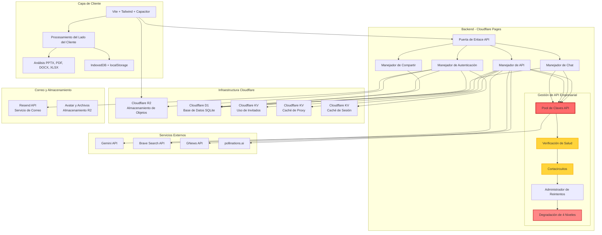

<div align="center">


# LittleAIBox

**Un Asistente de Conversación con IA Moderno y Multiplataforma**

[](https://opensource.org/licenses/MIT)
[](https://github.com/diandiancha/LittleAIBox)
[](https://github.com/diandiancha/LittleAIBox)
[](https://www.producthunt.com/products/littleaibox)

[中文](README.zh-CN.md) | [English](../README.md) | [日本語](README.ja.md) | [한국어](README.ko.md) | [Español](README.es.md) | [Français](README.fr.md)

Este proyecto está construido utilizando **Google Gemini API** para interacciones de IA conversacional, proporcionando una experiencia de IA inteligente.

</div>

---

> 🎓 Este proyecto está desarrollado con fines educativos y de investigación.  

> 💼 Los despliegues comerciales y servicios premium son operados por separado por el autor para garantizar la seguridad y sostenibilidad.

---

## 🎯 ¿Para Quién Es Esto?

LittleAIBox es perfecto para:

- **Usuarios en Regiones Restringidas**: Soluciones de retransmisión de servicio integradas para conectarte fácilmente con Gemini
- **Estudiantes e Investigadores**: Analiza artículos, presentaciones y documentos sin salir de tu navegador
- **Desarrolladores**: Obtén ayuda con código, contexto de archivos, explicaciones de código y asistencia técnica
- **Creadores de Contenido**: Genera y edita contenido markdown con soporte de IA
- **Usuarios Conscientes de la Privacidad**: Todo el procesamiento ocurre localmente; tú controlas tus datos

---

### 🚀 Demostración en Vivo

<div align="center">

**Pruébalo ahora:**  

[](https://littleaibox.com)

</div>

### 💡 ¿Por Qué LittleAIBox?

**¿Qué hace que este proyecto sea diferente?**

| Característica | LittleAIBox | Otros |
|---------|-------------|--------|
| Procesamiento de Archivos | 📄 Soporte PPTX, DOCX, PDF, XLSX | Limitado o solo en servidor |
| Privacidad | 🔒 Procesamiento en cliente, sin subidas | A menudo requiere subida de archivos |
| Soporte Offline | 📱 PWA completo, funciona offline | Capacidades offline limitadas |
| Multiplataforma | 🌐 Web + PWA + Android nativo | Generalmente solo web o móvil |
| Framework | ⚡ Vanilla JS, sin bloat | A menudo dependencias React/Vue |
| Acceso Regional | 🌍 Solución de retransmisión de servicio integrada | Puede estar restringido regionalmente |
| **Alta Disponibilidad** | 🛡️ **Pool de API de nivel empresarial** con verificaciones de salud y conmutación automática | ❌ Dependencia de API única, propensa a fallos |
| Código Abierto | ✅ 100% frontend de código abierto | Varía |
| Costo | 💰 Usa tu propia clave API | A menudo basado en suscripción |

**Elige LittleAIBox si quieres**: Máxima privacidad, diseño offline-first, cero dependencias de framework y control total sobre tus conversaciones de IA.

### 🌟 Descripción Oficial

> **Plataforma de Chat con IA Privada y Global**

> LittleAIBox es una aplicación de chat con IA Gemini de pila completa y multiplataforma (construida con Vite/Capacitor/Cloudflare) que cuenta con un backend inteligente de agrupación de API y proxy que evita las restricciones regionales para un acceso global estable. Las características principales incluyen:

> - Procesamiento del lado del cliente (soporte PDF/DOCX/PPTX)
> - Renderizado Mermaid/LaTeX/Vega-Lite con exportación de gráficos
> - Búsqueda web en tiempo real y modo de investigación Semantic Scholar
> - Navegación de línea de tiempo de conversación
> - Gestión de claves API duales con balanceo de carga inteligente
> - Parámetros AI personalizables y preajustes de tareas
> - Soporte de entrada por voz

> A diferencia de las aplicaciones de IA tradicionales, LittleAIBox se ejecuta localmente, asegurando que tus archivos y mensajes nunca abandonen tu dispositivo. Enfatiza la privacidad con rotación inteligente de claves API, proporciona acceso global estable y permite parámetros personalizados de IA para optimizar tu experiencia de chat. Los usuarios pueden optar por registrarse para sincronización en la nube, pero la plataforma funciona completamente sin una cuenta y no expone tu ubicación u origen de solicitud. LittleAIBox es de código abierto, ligero y diseñado para usuarios que valoran la privacidad, el control y la libertad.

> *[Ver en Product Hunt →](https://www.producthunt.com/products/littleaibox)*

### 📱 Capturas de Pantalla de la Aplicación

#### Página Principal


#### Página de Configuración


---

## ✨ Características Principales

### 🎯 **Procesamiento Inteligente de Archivos**
- **Documentos de Office**: Analiza archivos Word (.docx), PDF, Excel (.xlsx, .xls, .csv) y **PowerPoint (.pptx)** directamente en el navegador
- **Medios Enriquecidos**: Soporte para imágenes y archivos Markdown
- **Archivos de Texto Plano**: Soporte para varios formatos de archivos de texto
- **Visor de Archivos**: Visor de archivos integrado con resaltado de sintaxis para archivos de código, vista previa de imágenes y renderizado de texto enriquecido
- **Cero Subidas Requeridas**: Todo el procesamiento de archivos ocurre en el cliente para máxima privacidad

### 🔐 **Diseño Priorizando Privacidad**
- **No Requiere Registro**: Comienza a usar inmediatamente sin crear una cuenta
- **Múltiples Opciones de Inicio de Sesión**: Email/contraseña, OAuth (Google, GitHub) o modo invitado
- **Autenticación Multi-Factor (MFA)**: Soporte opcional de aplicación autenticadora TOTP con códigos de respaldo
- **Gestión de Claves API Duales**: Configura dos claves API con modo mixto inteligente (balanceo de carga) o modo único (cambio de respaldo)
- **Auto-Configuración de Clave API**: Usa tu propia clave API de Gemini, con control total de datos
- **Almacenamiento Flexible**: Las claves API de usuarios registrados se persisten para sincronización multi-dispositivo; las claves de usuarios invitados se almacenan solo localmente y se borran automáticamente al refrescar la página, garantizando privacidad
- **Gestión de Contraseñas**: Restablecimiento seguro de contraseña mediante verificación por email
- **Avatar Personalizado**: Sube y gestiona tu avatar de perfil

### 🌍 **Acceso Universal**
- **Solución de Restricción Regional**: Enrutamiento de retransmisión de servicio integrado para evitar limitaciones geográficas
- **Offline-First**: Soporte completo de PWA con capacidades offline
- **Multiplataforma**: Funciona perfectamente en Web, PWA y aplicaciones Android nativas

### 💬 **Renderizado Avanzado de Markdown**
- **Resaltado de Código**: Soporte para más de 40 lenguajes de programación
- **Expresiones Matemáticas**: Renderizado hermoso de matemáticas con KaTeX
- **Diagramas**: Soporte para diagramas Mermaid interactivos con exportación PNG/SVG
- **Visualización de Datos**: Renderizado de gráficos Vega-Lite con gráficos interactivos y exportación PNG
- **Exportación de Gráficos**: Descarga gráficos generados (diagramas Mermaid y visualizaciones Vega-Lite) como archivos PNG o SVG
- **GitHub Flavored Markdown**: Soporte completo de GFM con resaltado de sintaxis

### 🛠️ **Características Avanzadas de IA**
- **Múltiples Modos de Interacción**：
  - **Modo de Búsqueda**: Integración de búsqueda web en tiempo real para información actualizada
  - **Modo de Investigación**: Investigación académica impulsada por la API de Semantic Scholar - busca y cita automáticamente artículos académicos relevantes, estructura respuestas con formato Abstract/Introducción/Métodos/Resultados/Discusión/Conclusión, y proporciona citas en el texto [1], [2]...
  - **Modo de Generación de Imágenes**: Creación de imágenes impulsada por IA
- **Entrada por Voz**: Soporte de entrada de voz a texto (mejor en Chrome de escritorio)
- **Parámetros AI Personalizables**: Ajusta el comportamiento de la IA con:
  - Prompts del sistema para personalización de roles
  - Control de temperatura (creatividad vs. consistencia)
  - Parámetros avanzados (topK, topP)
  - Preajustes de tareas (asistente de codificación, asistente de escritura, traducción, investigación de chino clásico, guía de viajes, creación de rol)

### 🌐 **Soporte Multiidioma**
- **6 Idiomas**: Chino (Simplificado/Tradicional), Inglés, Japonés, Coreano, Español, Francés
- **Detección Inteligente**: Detección automática de idioma basada en la configuración del navegador
- **Carga Optimizada**: Caché inteligente de traducciones para cambio instantáneo de idioma

### 🎨 **Interfaz Hermosa**
- **Modo Oscuro/Claro**: Cambio de tema sin problemas
- **Fuentes Personalizadas**: Elige entre fuente del sistema, serif, monoespaciada o elegante cursiva
- **Diseño Responsivo**: Perfecto en escritorio, tablet y móvil
- **Sensación Nativa**: Integración de Capacitor para experiencia móvil nativa
- **Línea de Tiempo de Conversación**: Navegación de línea de tiempo flotante para acceso rápido a mensajes del asistente

### ⚡ **Optimizado para Rendimiento**
- **Carga Rápida**: Construcción con Vite con división de código
- **Caché Inteligente**: Service Worker con estrategias de caché inteligentes
- **Ligero**: JavaScript puro (sin frameworks pesados)

### 🛡️ **Arquitectura de Backend de Nivel Empresarial**
- **Pool Elástico de Claves API**: Rotación de múltiples claves de nivel de producción con balanceo de carga automático
- **Verificación de Salud y Circuit Breaker**: Monitoreo en tiempo real y protección de conmutación inteligente
- **Degradación Inteligente de 4 Niveles**: Continuidad de servicio sin problemas incluso bajo fallos
- **Alta Disponibilidad**: Tiempo de actividad garantizado con evitación automática de restricciones regionales

---

## 🏗️ Arquitectura

### 🏗️ Diagrama del Sistema



### 🧩 Stack de Frontend

**Tecnologías Principales**
- **Herramienta de Construcción**: Vite 7.x
- **Framework**: JavaScript Vanilla (Módulos ES6+) - Sin sobrecarga de framework
- **Estilos**: Tailwind CSS 4.x
- **Móvil**: Capacitor 7.x (soporte Android)

**Bibliotecas Clave**
- **Markdown**: marked.js + DOMPurify
- **Resaltado de Código**: highlight.js (más de 40 lenguajes)
- **Renderizado de Matemáticas**: KaTeX
- **Gráficos**: Mermaid, Vega-Lite
- **Análisis de Archivos**: mammoth (Word), PDF.js, xlsx, pptx2html
- **Reconocimiento de Voz**: Web Speech API
- **Almacenamiento**: IndexedDB + localStorage
- **Autenticación**: Autenticación basada en JWT con soporte OAuth 2.0 (Google, GitHub)
- **Seguridad**: Soporte MFA/TOTP con códigos de respaldo

### 💾 Procesamiento del Lado del Cliente

Todo el análisis y procesamiento de archivos ocurre completamente en el navegador:
- **Análisis PPTX**: Extracción completa de contenido de PowerPoint
- **Lectura PDF**: Extracción de texto y metadatos
- **Procesamiento Excel**: Análisis de datos de hojas de cálculo (.xlsx, .xls, .csv)
- **Documentos Word**: Análisis de archivos DOCX con preservación de formato
- **Manejo de Imágenes**: Procesamiento de imágenes en el cliente y codificación base64

### Soporte Offline

- **Service Worker**: Estrategias de caché personalizadas
- **IndexedDB**: Almacenamiento local de historial de chat y configuraciones
- **Aplicación Web Progresiva**: Instalable y funciona offline

### 🛡️ Arquitectura de Backend

El backend del proyecto está construido en **Cloudflare Pages**, aprovechando una arquitectura serverless moderna. 

**¿Por qué el backend es de código cerrado?**

Aunque estoy comprometido con la transparencia, el backend permanece cerrado por varias razones importantes:

1. **Seguridad**: Proteger datos de usuarios, claves API y mecanismos de autenticación
2. **Control de Costos**: Prevenir abuso de claves API y asegurar costos de servicio sostenibles
3. **Infraestructura**: Proteger estrategias de optimización propietarias y sistemas de conmutación
4. **Cumplimiento**: Cumplir requisitos regionales mientras se mantiene la calidad del servicio

**¿Qué es transparente?**

- ✅ Todo el código frontend es de código abierto y tiene licencia MIT
- ✅ Todos los endpoints de API son públicos y están bien documentados
- ✅ Puedes inspeccionar todas las solicitudes de red
- ✅ El procesamiento del lado del cliente es completamente auditable
- ✅ No hay seguimiento oculto ni recopilación de datos

**Para desarrolladores**: El código frontend demuestra todas las interacciones del backend, y puedes construir tu propio backend o auto-alojar toda la pila. Todas las APIs son públicas y estables.

#### Capa de Base de Datos Principal

**Cloudflare D1 (SQLite)**
- Sistema completo de autenticación de usuarios con múltiples métodos de inicio de sesión:
  - Email/contraseña con hash seguro bcrypt
  - Integración OAuth 2.0 (Google, GitHub)
  - Modo invitado para uso anónimo
- Soporte de Autenticación Multi-Factor (MFA):
  - Integración de aplicación autenticadora TOTP
  - Generación y gestión de códigos de respaldo
- Gestión de sesiones JWT para autenticación sin estado e inicio de sesión multi-dispositivo
- Flujo de restablecimiento de contraseña con verificación por email
- Persistencia del historial de chat con soporte de consulta y recuperación
- Gestión de configuración y preferencias del usuario

#### Principal: Pool Elástico de Claves API (APIKeyPool)

Este sistema cuenta con un sistema de gestión de claves API de nivel de producción y alta disponibilidad:

- **Rotación Multi-Clave**: Gestión inteligente de múltiples claves API de Gemini y Brave Search con balanceo de carga automático
- **Mecanismo de Verificación de Salud**: Monitoreo en tiempo real de la disponibilidad y calidad de respuesta de cada clave
- **Conmutación Automática**: Cambio sin problemas a claves de respaldo cuando una clave falla o alcanza límites de tasa
- **Protección Circuit Breaker**: Previene solicitudes repetidas a claves fallidas, protegiendo recursos del sistema
- **Estrategia de Reintento Inteligente**: Algoritmo de retroceso exponencial para maximizar las tasas de éxito de solicitudes

#### Principal: Sistema de Conmutación y Degradación Inteligente

Implementada una arquitectura de degradación inteligente de cuatro niveles cuidadosamente diseñada, asegurando alta disponibilidad y continuidad de servicio:

1. **Prioridad de Clave de Usuario**: Prioriza las claves API configuradas por el usuario
2. **Modo Híbrido**: Complementa inteligentemente con claves del servidor cuando es necesario
3. **Modo de Clave Única**: Clave del servidor como solución de respaldo
4. **Respaldo del Servidor**: Protección final asegurando continuidad de servicio

El sistema detecta y evita automáticamente restricciones regionales, claves inválidas, fallos de red y otros problemas, proporcionando a los usuarios un servicio consistente y estable.

#### Ecosistema de Servicios Integrados

**Servicios de Email**
- **Resend**: Para flujos seguros de verificación de correo y restablecimiento de contraseña
- Soporta plantillas HTML y contenido de correo internacionalizado
- Recuperación y verificación de cuenta basada en email

**Búsqueda y Contenido**
- **Brave Search API**: Resultados de búsqueda web de alta calidad para mejorar la comprensión del contexto de IA
- **GNews API**: Integración de noticias en tiempo real para consultas de información más reciente

**Generación de Imágenes**
- **pollinations.ai**: Servicio de generación de imágenes de alto rendimiento que admite múltiples estilos artísticos
- Servicio proxy del lado del cliente para protección de privacidad del usuario

**Almacenamiento en la Nube**
- **Cloudflare R2**: Almacenamiento de objetos compatible con S3 para avatares y adjuntos de usuario
- Aceleración CDN global con acceso de baja latencia
- **Cloudflare KV**: Almacenamiento clave-valor de alto rendimiento para caché, gestión de sesiones y seguimiento de límites de uso

---

## 📚 Documentación

<div align="center">

**Navegación Rápida a Recursos del Proyecto**

[](../LEARN.md) 
[](CONTRIBUTING.es.md) 
[](../.github/CODE_OF_CONDUCT.md) 
[](../.github/SECURITY.md)

**📖 [Índice Completo de Documentación](../docs/)**

</div>

---

## 📁 Estructura del Proyecto

```
LittleAIBox/
├── src/                    # Código fuente
│   ├── main.js            # Lógica principal de la aplicación
│   ├── api-config.js      # Configuración de API
│   ├── auth-oauth.js     # Autenticación OAuth (Google, GitHub)
│   ├── auth-template.js  # Plantillas de UI de autenticación
│   ├── auth.css          # Estilos de autenticación
│   ├── db.js              # Envoltorio de IndexedDB
│   ├── i18n.js            # Internacionalización
│   ├── mermaid-renderer.js # Renderizado de diagramas
│   ├── vega-renderer.js    # Renderizado de gráficos Vega-Lite
│   ├── floating-timeline.js # Navegación de línea de tiempo de conversación
│   ├── floating-timeline.css # Estilos de línea de tiempo
│   ├── mfa-login.js      # Autenticación multi-factor
│   ├── oauth-flow.js     # Manejo de flujo OAuth
│   ├── router.js         # Enrutamiento del lado del cliente
│   ├── style.css          # Estilos globales
│   └── sw-custom.js       # Service Worker
├── public/                 # Recursos estáticos
│   ├── locales/           # Archivos de traducción (6 idiomas)
│   ├── libs/              # Bibliotecas de terceros
│   ├── images/            # Imágenes e iconos
│   └── manifest.webmanifest # Manifesto PWA
├── appshow/                # Capturas de pantalla por idioma
├── docs/                   # Documentación (multi-idioma)
├── capacitor.config.json   # Configuración de aplicación móvil
├── vite.config.js          # Configuración de construcción
├── tailwind.config.js      # Configuración de Tailwind CSS
└── package.json            # Dependencias
```

---

## 🚀 Comenzando

### 📝 Nota de Uso

**Nota de Uso**: Recomendamos configurar tu propia clave API de Gemini para la mejor experiencia. No se requiere registro: simplemente ingresa tu clave API en la página de configuración para comenzar.

Obtener Clave API: [Google AI Studio](https://aistudio.google.com/api-keys)

### Prerrequisitos

- Node.js 18+ 
- npm o yarn
- Una clave API de Gemini (opcional, pero recomendada para la mejor experiencia)

> **Nota**: Aunque el servicio puede funcionar con claves API compartidas, recomendamos encarecidamente usar tu propia clave API para mejor rendimiento y privacidad.

### Instalación

```bash
# Clonar el repositorio
git clone https://github.com/diandiancha/LittleAIBox.git
cd LittleAIBox

# Instalar dependencias
npm install

# Iniciar servidor de desarrollo
npm run dev

# Construir para producción
npm run build
```

### Configuración

1. **Obtén Tu Clave API** (si no tienes una):
   - Visita [Google AI Studio](https://aistudio.google.com/api-keys)
   - Crea una nueva clave API
   - Copia la clave para usar en la aplicación

2. **Configura en la Aplicación**:
   - Abre la aplicación: [LittleAIBox](https://littleaibox.com)
   - Ve a Configuración
   - Ingresa tu clave API de Gemini
   - ¡Guarda y comienza a chatear!

3. **Opciones de Cuenta** (Opcional):
   - **Crear Cuenta**: Regístrate con email/contraseña o usa OAuth (Google/GitHub)
   - **Habilitar MFA**: Ve a Configuración → Seguridad para configurar la aplicación autenticadora TOTP
   - **Modo Invitado**: Usa sin registro (las claves API se almacenan solo localmente)

### Solución de Problemas

**Problemas Comunes:**

| Problema | Solución |
|-------|----------|
| La clave API no funciona | Asegúrate de que tu clave sea de Google AI Studio y tenga cuota restante |
| Los archivos no se analizan | Revisa la consola del navegador para errores; asegúrate de que el formato de archivo sea compatible |
| Respuestas lentas | Verifica tu conexión de red; considera usar tu propia clave API |
| La construcción móvil falla | Asegúrate de que Android Studio esté instalado y el entorno esté configurado correctamente |

**¿Necesitas Ayuda?**
- Revisa [Issues](https://github.com/diandiancha/LittleAIBox/issues) para problemas conocidos
- Abre un nuevo issue con los detalles de tu problema

### Construcción para Móvil

```bash
# Agregar plataforma Android
npx cap add android

# Sincronizar archivos
npx cap sync

# Abrir en Android Studio
npx cap open android
```

---

## 🎯 Casos de Uso

- **Investigación Académica**: Analizar y analizar artículos de investigación, presentaciones
- **Creación de Contenido**: Generar y editar contenido markdown con IA
- **Asistencia de Código**: Obtener ayuda con tareas de programación y explicaciones de código
- **Análisis de Documentos**: Extraer insights de documentos de Office
- **Herramienta de Aprendizaje**: Tutoría interactiva de IA con archivos adjuntos

---

## 🤝 Contribuir

¡Bienvenida la contribución! Ya sea que estés corrigiendo errores, agregando características o mejorando la documentación, cada contribución hace que LittleAIBox sea mejor.

### Cómo Contribuir

1. **Haz fork del repositorio** y clónalo localmente
2. **Crea una rama**: `git checkout -b feature/tu-nombre-de-característica`
3. **Haz tus cambios** y pruébalos a fondo
4. **Confirma tus cambios**: `git commit -m "Add: descripción de tus cambios"`
5. **Haz push a tu fork**: `git push origin feature/tu-nombre-de-característica`
6. **Abre un Pull Request** con una descripción clara de tus cambios

### Pautas

- Sigue el estilo y convenciones de código existentes
- Agrega comentarios para lógica compleja
- Actualiza la documentación para nuevas características
- Escribe mensajes de commit claros
- Prueba tus cambios antes de enviar

### Hoja de Ruta

Estoy trabajando activamente en:

- 🌐 Soporte iOS (Capacitor)
- 📊 Más soporte de formatos de archivo
- 🎨 Temas personalizados
- 🔌 Sistema de plugins
- 🌍 Más idiomas
- 📱 Características móviles mejoradas

¿Tienes ideas? [Abre un issue](https://github.com/diandiancha/LittleAIBox/issues) o inicia una discusión!

---

## 🔒 Privacidad y Seguridad

- **Procesamiento del Lado del Cliente**: El análisis de archivos ocurre en tu navegador
- **Almacenamiento Local**: El historial de chat se almacena localmente (sincronización en la nube opcional)
- **Autenticación Segura**：
  - Múltiples opciones de inicio de sesión (email/contraseña, OAuth)
  - MFA/TOTP opcional para mayor seguridad
  - Restablecimiento seguro de contraseña mediante verificación por email
- **Sin Seguimiento**: Diseño priorizando privacidad
- **Código Abierto**: Código transparente y auditable
- **Seguridad de Claves API**: Las claves API de usuario se cifran y almacenan de forma segura

🧠 **Todo el procesamiento ocurre localmente o a través de tu clave API configurada — ningún dato abandona tu dispositivo sin tu consentimiento.**

---

## 📄 Licencia

Este proyecto está licenciado bajo la [Licencia MIT](LICENSE).

Copyright (c) 2025 diandiancha

---

<div align="center">

Hecho con ❤️ por diandiancha

**¡Dale una ⭐ a este repositorio si te resulta útil!**

💬 **¿Preguntas o comentarios? [Abre un issue](https://github.com/diandiancha/LittleAIBox/issues) — ¡Leo cada uno de ellos!**

</div>