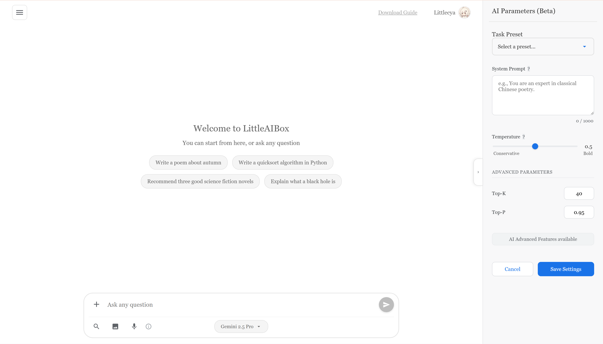
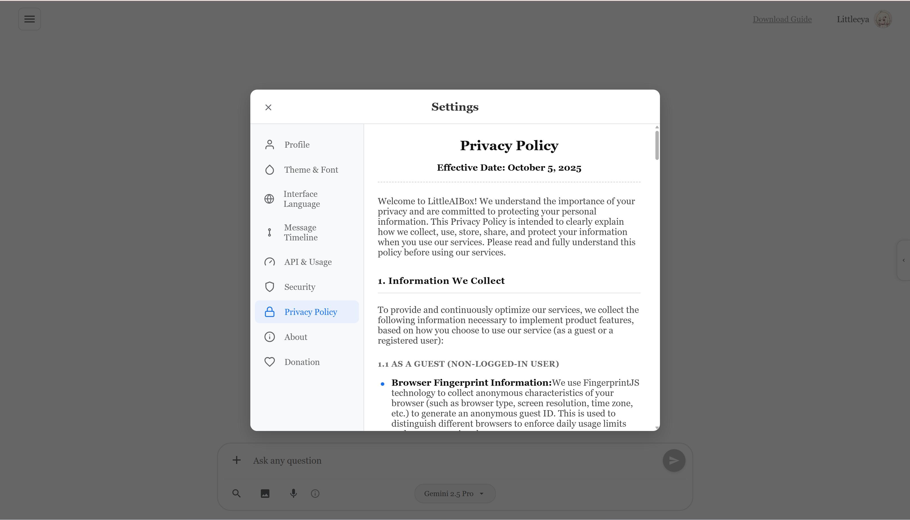
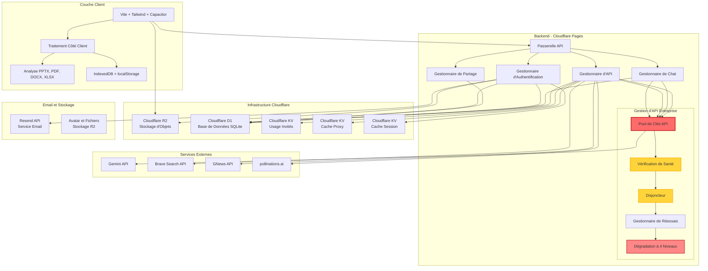

<div align="center">


# LittleAIBox

**Un Assistant de Conversation IA Moderne et Multiplateforme**

[](https://opensource.org/licenses/MIT)
[](https://github.com/diandiancha/LittleAIBox)
[](https://github.com/diandiancha/LittleAIBox)
[](https://www.producthunt.com/products/littleaibox)

[中文](README.zh-CN.md) | [English](../README.md) | [日本語](README.ja.md) | [한국어](README.ko.md) | [Español](README.es.md) | [Français](README.fr.md)

Ce projet est construit avec l'**API Google Gemini** pour des interactions d'IA conversationnelle, offrant une expérience d'IA intelligente.

</div>

---

> 🎓 Ce projet est développé à des fins éducatives et de recherche.  

> 💼 Les déploiements commerciaux et les services premium sont exploités séparément par l'auteur pour assurer la sécurité et la durabilité.

---

## 🎯 À Qui S'adresse Ce Projet ?

LittleAIBox est parfait pour :

- **Utilisateurs dans des Régions Restreintes** : Solutions de relais de service intégrées pour vous connecter facilement à Gemini
- **Étudiants et Chercheurs** : Analysez des articles, des présentations et des documents sans quitter votre navigateur
- **Développeurs** : Obtenez de l'aide pour le code avec le contexte des fichiers, des explications de code et une assistance technique
- **Créateurs de Contenu** : Générez et éditez du contenu markdown avec le support de l'IA
- **Utilisateurs Soucieux de la Vie Privée** : Tout le traitement se fait localement ; vous contrôlez vos données

---

### 🚀 Démonstration en Direct

<div align="center">

**Essayez maintenant :**  

[](https://littleaibox.com)

</div>

### 💡 Pourquoi LittleAIBox ?

**Qu'est-ce qui rend ce projet différent ?**

| Fonctionnalité | LittleAIBox | Autres |
|---------|-------------|--------|
| Traitement de Fichiers | 📄 Support PPTX, DOCX, PDF, XLSX | Limité ou côté serveur uniquement |
| Vie Privée | 🔒 Traitement côté client, pas de téléchargement | Nécessite souvent le téléchargement de fichiers |
| Support Hors Ligne | 📱 PWA complète, fonctionne hors ligne | Capacités hors ligne limitées |
| Multiplateforme | 🌐 Web + PWA + Android natif | Généralement web ou mobile uniquement |
| Framework | ⚡ Vanilla JS, zéro surcharge | Souvent dépendances React/Vue |
| Accès Régional | 🌍 Solution de relais de service intégrée | Peut être restreint régionalement |
| **Haute Disponibilité** | 🛡️ **Pool d'API de niveau entreprise** avec vérifications de santé et basculement automatique | ❌ Dépendance API unique, sujet aux pannes |
| Open Source | ✅ 100% frontend open-source | Variable |
| Coût | 💰 Utilisez votre propre clé API | Souvent basé sur abonnement |

**Choisissez LittleAIBox si vous voulez** : Confidentialité maximale, conception hors ligne d'abord, zéro dépendance de framework et contrôle total sur vos conversations IA.

### 🌟 Description Officielle

> **Plateforme de Chat IA Privée et Globale**

> LittleAIBox est une application de chat IA Gemini full-stack et multiplateforme (construite avec Vite/Capacitor/Cloudflare) dotée d'un backend intelligent de mise en commun d'API et de proxy qui contourne les restrictions régionales pour un accès global stable. Les fonctionnalités clés incluent :

> - Analyse côté client (support PDF/DOCX/PPTX)
> - Rendu Mermaid/LaTeX/Vega-Lite avec export de graphiques
> - Recherche web en temps réel et mode recherche Semantic Scholar
> - Navigation chronologique des conversations
> - Gestion de double clé API avec équilibrage de charge intelligent
> - Paramètres IA personnalisables et préréglages de tâches
> - Support d'entrée vocale

> Contrairement aux applications IA traditionnelles, LittleAIBox s'exécute localement, garantissant que vos fichiers et messages ne quittent jamais votre appareil. Il met l'accent sur la confidentialité avec une rotation intelligente des clés API, fournit un accès global stable et permet des paramètres IA personnalisés pour optimiser votre expérience de chat. Les utilisateurs peuvent optionnellement s'inscrire pour la synchronisation cloud, mais la plateforme fonctionne entièrement sans compte et n'expose pas votre emplacement ou l'origine de la requête. LittleAIBox est open-source, léger et conçu pour les utilisateurs qui valorisent la confidentialité, le contrôle et la liberté.

> *[Voir sur Product Hunt →](https://www.producthunt.com/products/littleaibox)*

### 📱 Captures d'Écran de l'Application

#### Page Principale



#### Page des Paramètres



---

## ✨ Fonctionnalités Principales

### 🎯 **Traitement Intelligent des Fichiers**
- **Documents Office** : Analysez des fichiers Word (.docx), PDF, Excel (.xlsx, .xls, .csv) et **PowerPoint (.pptx)** directement dans le navigateur
- **Médias Enrichis** : Support pour les images et les fichiers Markdown
- **Fichiers Texte Brut** : Support pour divers formats de fichiers texte
- **Visionneuse de Fichiers** : Visionneuse intégrée avec coloration syntaxique pour les fichiers de code, aperçu des images et rendu de texte enrichi
- **Zéro Téléchargement Requis** : Tout le traitement des fichiers se fait côté client pour une confidentialité maximale

### 🔐 **Conception Axée sur la Vie Privée**
- **Pas d'Inscription Requise** : Commencez à utiliser immédiatement sans créer de compte
- **Options de Connexion Multiples** : Email/mot de passe, OAuth (Google, GitHub) ou mode invité
- **Authentification Multi-Facteurs (MFA)** : Support optionnel d'application d'authentification TOTP avec codes de secours
- **Gestion de Double Clé API** : Configurez deux clés API avec mode mixte intelligent (équilibrage de charge) ou mode unique (basculement de secours)
- **Auto-Configuration de Clé API** : Utilisez votre propre clé API Gemini, avec contrôle total des données
- **Stockage Flexible** : Les clés API des utilisateurs enregistrés sont persistées pour la synchronisation multi-appareils ; les clés des utilisateurs invités sont stockées localement uniquement et automatiquement effacées lors du rafraîchissement de la page, garantissant la confidentialité
- **Gestion des Mots de Passe** : Réinitialisation sécurisée du mot de passe via vérification par email
- **Avatar Personnalisé** : Téléchargez et gérez votre avatar de profil

### 🌍 **Accès Universel**
- **Solution de Restriction Régionale** : Routage de relais de service intégré pour contourner les limitations géographiques
- **Hors Ligne d'Abord** : Support PWA complet avec capacités hors ligne
- **Multiplateforme** : Fonctionne parfaitement sur Web, PWA et applications Android natives

### 💬 **Rendu Markdown Avancé**
- **Coloration de Code** : Support pour plus de 40 langages de programmation
- **Expressions Mathématiques** : Beau rendu mathématique avec KaTeX
- **Diagrammes** : Support de diagrammes Mermaid interactifs avec export PNG/SVG
- **Visualisation de Données** : Rendu de graphiques Vega-Lite avec graphiques interactifs et export PNG
- **Export de Graphiques** : Téléchargez les graphiques générés (diagrammes Mermaid et visualisations Vega-Lite) en fichiers PNG ou SVG
- **GitHub Flavored Markdown** : Support complet GFM avec coloration syntaxique

### 🛠️ **Fonctionnalités IA Avancées**
- **Modes d'Interaction Multiples** :
  - **Mode Recherche** : Intégration de recherche web en temps réel pour des informations à jour
  - **Mode Recherche Académique** : Recherche académique alimentée par l'API Semantic Scholar - recherche et cite automatiquement des articles académiques pertinents, structure les réponses avec le format Résumé/Introduction/Méthodes/Résultats/Discussion/Conclusion, et fournit des citations dans le texte [1], [2]...
  - **Mode Génération d'Images** : Création d'images alimentée par l'IA
- **Entrée Vocale** : Support d'entrée voix-vers-texte (meilleur sur Chrome bureau)
- **Paramètres IA Personnalisables** : Ajustez le comportement de l'IA avec :
  - Prompts système pour la personnalisation des rôles
  - Contrôle de température (créativité vs. cohérence)
  - Paramètres avancés (topK, topP)
  - Préréglages de tâches (assistant de codage, assistant d'écriture, traduction, recherche en chinois classique, guide de voyage, jeu de rôle créatif)

### 🌐 **Support Multilingue**
- **6 Langues** : Chinois (Simplifié/Traditionnel), Anglais, Japonais, Coréen, Espagnol, Français
- **Détection Intelligente** : Détection automatique de la langue basée sur les paramètres du navigateur
- **Chargement Optimisé** : Mise en cache intelligente des traductions pour un changement de langue instantané

### 🎨 **Belle Interface UI/UX**
- **Mode Sombre/Clair** : Changement de thème fluide
- **Polices Personnalisées** : Choisissez entre la police système par défaut, serif, monospace ou cursive élégante
- **Design Responsive** : Parfait sur bureau, tablette et mobile
- **Sensation Native** : Intégration Capacitor pour une expérience mobile native
- **Chronologie de Conversation** : Navigation chronologique flottante pour un accès rapide aux messages de l'assistant

### ⚡ **Optimisé pour la Performance**
- **Chargement Rapide** : Build alimenté par Vite avec division de code
- **Mise en Cache Intelligente** : Service Worker avec stratégies de cache intelligentes
- **Léger** : JavaScript pur (pas de frameworks lourds)

### 🛡️ **Architecture Backend de Niveau Entreprise**
- **Pool Élastique de Clés API** : Rotation multi-clés de niveau production avec équilibrage de charge automatique
- **Vérification de Santé et Disjoncteur** : Surveillance en temps réel et protection de basculement intelligent
- **Dégradation Intelligente à 4 Niveaux** : Continuité de service fluide même en cas de pannes
- **Haute Disponibilité** : Disponibilité garantie avec contournement automatique des restrictions régionales

---

## 🏗️ Architecture

### 🏗️ Diagramme du Système



### 🧩 Stack Frontend

**Technologies Principales**
- **Outil de Build** : Vite 7.x
- **Framework** : JavaScript Vanilla (Modules ES6+) - Zéro surcharge de framework
- **Styles** : Tailwind CSS 4.x
- **Mobile** : Capacitor 7.x (support Android)

**Bibliothèques Clés**
- **Markdown** : marked.js + DOMPurify
- **Coloration de Code** : highlight.js (plus de 40 langages)
- **Rendu Mathématique** : KaTeX
- **Graphiques** : Mermaid, Vega-Lite
- **Analyse de Fichiers** : mammoth (Word), PDF.js, xlsx, pptx2html
- **Reconnaissance Vocale** : Web Speech API
- **Stockage** : IndexedDB + localStorage
- **Authentification** : Authentification basée JWT avec support OAuth 2.0 (Google, GitHub)
- **Sécurité** : Support MFA/TOTP avec codes de secours

### 💾 Traitement Côté Client

Toute l'analyse et le traitement des fichiers se fait entièrement dans le navigateur :
- **Analyse PPTX** : Extraction complète du contenu PowerPoint
- **Lecture PDF** : Extraction de texte et métadonnées
- **Traitement Excel** : Analyse de données de feuilles de calcul (.xlsx, .xls, .csv)
- **Documents Word** : Analyse de fichiers DOCX avec préservation du formatage
- **Gestion d'Images** : Traitement d'images côté client et encodage base64

### Support Hors Ligne

- **Service Worker** : Stratégies de cache personnalisées
- **IndexedDB** : Stockage local de l'historique de chat et des paramètres
- **Application Web Progressive** : Installable et fonctionne hors ligne

### 🛡️ Architecture Backend

Le backend du projet est construit sur **Cloudflare Pages**, exploitant une architecture serverless moderne. 

**Pourquoi le backend est-il fermé ?**

Bien que je sois engagé pour la transparence, le backend reste fermé pour plusieurs raisons importantes :

1. **Sécurité** : Protection des données utilisateur, des clés API et des mécanismes d'authentification
2. **Contrôle des Coûts** : Prévention de l'abus des clés API et assurance de coûts de service durables
3. **Infrastructure** : Protection des stratégies d'optimisation propriétaires et des systèmes de basculement
4. **Conformité** : Respect des exigences régionales tout en maintenant la qualité du service

**Qu'est-ce qui est transparent ?**

- ✅ Tout le code frontend est open-source et sous licence MIT
- ✅ Tous les endpoints API sont publics et bien documentés
- ✅ Vous pouvez inspecter toutes les requêtes réseau
- ✅ Le traitement côté client est entièrement auditable
- ✅ Pas de suivi caché ni de collecte de données

**Pour les développeurs** : Le code frontend démontre toutes les interactions backend, et vous pouvez construire votre propre backend ou auto-héberger toute la pile. Toutes les API sont publiques et stables.

#### Couche de Base de Données Principale

**Cloudflare D1 (SQLite)**
- Système d'authentification utilisateur complet avec plusieurs méthodes de connexion :
  - Email/mot de passe avec hachage bcrypt sécurisé
  - Intégration OAuth 2.0 (Google, GitHub)
  - Mode invité pour utilisation anonyme
- Support d'Authentification Multi-Facteurs (MFA) :
  - Intégration d'application d'authentification TOTP
  - Génération et gestion de codes de secours
- Gestion de sessions JWT pour authentification sans état et connexion multi-appareils
- Flux de réinitialisation de mot de passe avec vérification par email
- Persistance de l'historique de chat avec support de requête et récupération
- Gestion de configuration et préférences utilisateur

#### Principal : Pool Élastique de Clés API (APIKeyPool)

Ce système dispose d'un système de gestion de clés API de niveau production et haute disponibilité :

- **Rotation Multi-Clés** : Gestion intelligente de plusieurs clés API Gemini et Brave Search avec équilibrage de charge automatique
- **Mécanisme de Vérification de Santé** : Surveillance en temps réel de la disponibilité et de la qualité de réponse de chaque clé
- **Basculement Automatique** : Changement fluide vers les clés de secours quand une clé échoue ou atteint les limites de taux
- **Protection Disjoncteur** : Empêche les requêtes répétées vers les clés en échec, protégeant les ressources système
- **Stratégie de Réessai Intelligente** : Algorithme de recul exponentiel pour maximiser les taux de succès des requêtes

#### Principal : Système de Basculement et Dégradation Intelligent

Architecture de dégradation intelligente à quatre niveaux soigneusement conçue, assurant haute disponibilité et continuité de service :

1. **Priorité Clé Utilisateur** : Priorise les clés API configurées par l'utilisateur
2. **Mode Hybride** : Complète intelligemment avec les clés serveur quand nécessaire
3. **Mode Clé Unique** : Clé serveur comme solution de secours
4. **Basculement Serveur** : Protection finale assurant la continuité de service

Le système détecte et contourne automatiquement les restrictions régionales, les clés invalides, les pannes réseau et autres problèmes, fournissant aux utilisateurs un service cohérent et stable.

#### Écosystème de Services Intégrés

**Services Email**
- **Resend** : Pour les flux sécurisés de vérification d'email et de réinitialisation de mot de passe
- Support des templates HTML et du contenu email internationalisé
- Récupération et vérification de compte basées sur email

**Recherche et Contenu**
- **Brave Search API** : Résultats de recherche web de haute qualité pour améliorer la compréhension du contexte IA
- **GNews API** : Intégration de nouvelles en temps réel pour les requêtes d'information récentes

**Génération d'Images**
- **pollinations.ai** : Service de génération d'images haute performance supportant plusieurs styles artistiques
- Service proxy côté client pour la protection de la vie privée des utilisateurs

**Stockage Cloud**
- **Cloudflare R2** : Stockage d'objets compatible S3 pour les avatars et pièces jointes utilisateur
- Accélération CDN globale avec accès à faible latence
- **Cloudflare KV** : Stockage clé-valeur haute performance pour le cache, la gestion des sessions et le suivi des limites d'utilisation

---

## 📚 Documentation

<div align="center">

**Navigation Rapide vers les Ressources du Projet**

[](../LEARN.md) 
[](CONTRIBUTING.es.md) 
[](../.github/CODE_OF_CONDUCT.md) 
[](../.github/SECURITY.md)

**📖 [Index Complet de la Documentation](../docs/)**

</div>

---

## 📁 Structure du Projet

```
LittleAIBox/
├── src/                    # Code source
│   ├── main.js            # Logique principale de l'application
│   ├── api-config.js      # Configuration de l'API
│   ├── auth-oauth.js      # Authentification OAuth (Google, GitHub)
│   ├── auth-template.js   # Templates UI d'authentification
│   ├── auth.css           # Styles d'authentification
│   ├── db.js              # Wrapper IndexedDB
│   ├── i18n.js            # Internationalisation
│   ├── mermaid-renderer.js # Rendu de diagrammes
│   ├── vega-renderer.js    # Rendu de graphiques Vega-Lite
│   ├── floating-timeline.js # Navigation chronologique de conversation
│   ├── floating-timeline.css # Styles de chronologie
│   ├── mfa-login.js       # Authentification multi-facteurs
│   ├── oauth-flow.js      # Gestion du flux OAuth
│   ├── router.js          # Routage côté client
│   ├── style.css          # Styles globaux
│   └── sw-custom.js       # Service Worker
├── public/                 # Ressources statiques
│   ├── locales/           # Fichiers de traduction (6 langues)
│   ├── libs/              # Bibliothèques tierces
│   ├── images/            # Images et icônes
│   └── manifest.webmanifest # Manifeste PWA
├── appshow/                # Captures d'écran par langue
├── docs/                   # Documentation (multi-langue)
├── capacitor.config.json   # Configuration de l'app mobile
├── vite.config.js          # Configuration de build
├── tailwind.config.js      # Configuration Tailwind CSS
└── package.json            # Dépendances
```

---

## 🚀 Démarrage

### 📝 Note d'Utilisation

**Note d'Utilisation** : Nous recommandons de configurer votre propre clé API Gemini pour la meilleure expérience. Pas d'inscription nécessaire - entrez simplement votre clé API dans la page des paramètres pour commencer.

Obtenir une Clé API : [Google AI Studio](https://aistudio.google.com/api-keys)

### Prérequis

- Node.js 18+ 
- npm ou yarn
- Une clé API Gemini (optionnel, mais recommandé pour la meilleure expérience)

> **Note** : Bien que le service puisse fonctionner avec des clés API partagées, nous recommandons fortement d'utiliser votre propre clé API pour de meilleures performances et confidentialité.

### Installation

```bash
# Cloner le dépôt
git clone https://github.com/diandiancha/LittleAIBox.git
cd LittleAIBox

# Installer les dépendances
npm install

# Démarrer le serveur de développement
npm run dev

# Build pour la production
npm run build
```

### Configuration

1. **Obtenez Votre Clé API** (si vous n'en avez pas) :
   - Visitez [Google AI Studio](https://aistudio.google.com/api-keys)
   - Créez une nouvelle clé API
   - Copiez la clé pour l'utiliser dans l'application

2. **Configurez dans l'Application** :
   - Ouvrez l'application : [LittleAIBox](https://littleaibox.com)
   - Allez dans Paramètres
   - Entrez votre clé API Gemini
   - Enregistrez et commencez à discuter !

3. **Options de Compte** (Optionnel) :
   - **Créer un Compte** : Inscrivez-vous avec email/mot de passe ou utilisez OAuth (Google/GitHub)
   - **Activer MFA** : Allez dans Paramètres → Sécurité pour configurer l'application d'authentification TOTP
   - **Mode Invité** : Utilisez sans inscription (les clés API sont stockées localement uniquement)

### Dépannage

**Problèmes Courants :**

| Problème | Solution |
|---------|----------|
| La clé API ne fonctionne pas | Assurez-vous que votre clé provient de Google AI Studio et a du quota restant |
| Les fichiers ne s'analysent pas | Vérifiez la console du navigateur pour les erreurs ; assurez-vous que le format de fichier est supporté |
| Réponses lentes | Vérifiez votre connexion réseau ; envisagez d'utiliser votre propre clé API |
| Le build mobile échoue | Assurez-vous qu'Android Studio est installé et que l'environnement est correctement configuré |

**Besoin d'Aide ?**
- Consultez [Issues](https://github.com/diandiancha/LittleAIBox/issues) pour les problèmes connus
- Ouvrez un nouvel issue avec les détails de votre problème

### Build pour Mobile

```bash
# Ajouter la plateforme Android
npx cap add android

# Synchroniser les fichiers
npx cap sync

# Ouvrir dans Android Studio
npx cap open android
```

---

## 🎯 Cas d'Utilisation

- **Recherche Académique** : Analyser des articles de recherche, des présentations
- **Création de Contenu** : Générer et éditer du contenu markdown avec l'IA
- **Assistance au Code** : Obtenir de l'aide pour les tâches de programmation et les explications de code
- **Analyse de Documents** : Extraire des insights de documents Office
- **Outil d'Apprentissage** : Tutorat IA interactif avec pièces jointes

---

## 🤝 Contribuer

Les contributions sont les bienvenues ! Que vous corrigiez des bugs, ajoutiez des fonctionnalités ou amélioriez la documentation, chaque contribution rend LittleAIBox meilleur.

### Comment Contribuer

1. **Forkez le dépôt** et clonez-le localement
2. **Créez une branche** : `git checkout -b feature/votre-nom-de-fonctionnalite`
3. **Faites vos modifications** et testez-les minutieusement
4. **Committez vos modifications** : `git commit -m "Add: description de vos modifications"`
5. **Pushez vers votre fork** : `git push origin feature/votre-nom-de-fonctionnalite`
6. **Ouvrez une Pull Request** avec une description claire de vos modifications

### Directives

- Suivez le style et les conventions de code existants
- Ajoutez des commentaires pour la logique complexe
- Mettez à jour la documentation pour les nouvelles fonctionnalités
- Écrivez des messages de commit clairs
- Testez vos modifications avant de soumettre

### Feuille de Route

Je travaille activement sur :

- 🌐 Support iOS (Capacitor)
- 📊 Plus de formats de fichiers supportés
- 🎨 Thèmes personnalisés
- 🔌 Système de plugins
- 🌍 Plus de langues
- 📱 Fonctionnalités mobiles améliorées

Vous avez des idées ? [Ouvrez un issue](https://github.com/diandiancha/LittleAIBox/issues) ou lancez une discussion !

---

## 🔒 Vie Privée et Sécurité

- **Traitement Côté Client** : L'analyse des fichiers se fait dans votre navigateur
- **Stockage Local** : L'historique de chat est stocké localement (synchronisation cloud optionnelle)
- **Authentification Sécurisée** :
  - Options de connexion multiples (email/mot de passe, OAuth)
  - MFA/TOTP optionnel pour une sécurité renforcée
  - Réinitialisation sécurisée du mot de passe via vérification par email
- **Pas de Suivi** : Conception axée sur la vie privée
- **Open Source** : Code transparent et auditable
- **Sécurité des Clés API** : Les clés API utilisateur sont chiffrées et stockées de manière sécurisée

🧠 **Tout le traitement se fait localement ou via votre clé API configurée — aucune donnée ne quitte votre appareil sans votre consentement.**

---

## 📄 Licence

Ce projet est sous licence [Licence MIT](LICENSE).

Copyright (c) 2025 diandiancha

---

<div align="center">

Fait avec ❤️ par diandiancha

**Mettez une ⭐ à ce repo si vous le trouvez utile !**

💬 **Des questions ou des commentaires ? [Ouvrez un issue](https://github.com/diandiancha/LittleAIBox/issues) — je lis chacun d'entre eux !**

</div>
