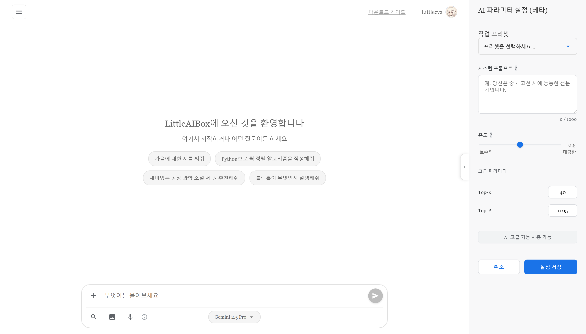
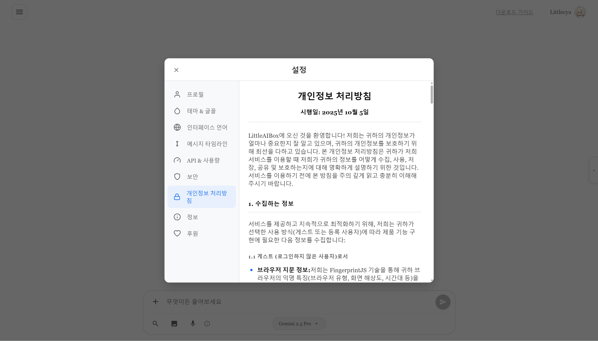
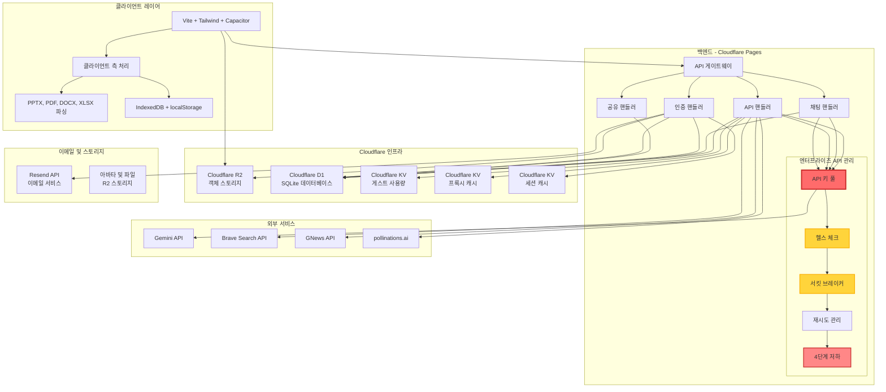

<div align="center">


# LittleAIBox

**현대적인 크로스 플랫폼 AI 대화 어시스턴트**

[](https://opensource.org/licenses/MIT)
[](https://github.com/diandiancha/LittleAIBox)
[](https://github.com/diandiancha/LittleAIBox)
[](https://www.producthunt.com/products/littleaibox)

[中文](README.zh-CN.md) | [English](../README.md) | [日本語](README.ja.md) | [한국어](README.ko.md) | [Español](README.es.md)

이 프로젝트는 지능형 AI 경험을 제공하기 위해 **Google Gemini API**를 사용하여 대화 기능을 구축합니다.

</div>

---

> 🎓 이 프로젝트는 교육 및 연구 목적으로 개발되었습니다。

> 💼 상업적 배포 및 프리미엄 서비스는 보안과 지속가능성을 보장하기 위해 작성자가 별도로 운영합니다。

---

## 🎯 이 프로젝트는 누구에게 적합한가요?

LittleAIBox는 다음 사용자에게 완벽합니다:

- **제한된 지역 사용자**: Gemini와의 연결을 쉽게 만드는 내장 서비스 릴레이 솔루션
- **학생 및 연구자**: 브라우저를 떠나지 않고 논문, 프레젠테이션, 문서 분석
- **개발자**: 파일 컨텍스트, 코드 설명, 기술 지원을 통한 코딩 도움
- **콘텐츠 크리에이터**: AI 지원으로 Markdown 콘텐츠 생성 및 편집
- **프라이버시 중심 사용자**: 모든 처리가 로컬에서 수행되며 데이터를 완전히 제어

---

### 🚀 라이브 데모

<div align="center">

**지금 사용해보세요:**  

[](https://ai.littletea.xyz)

</div>

### 💡 왜 LittleAIBox를 선택해야 할까요?

**이 프로젝트의 차별점:**

| 기능 | LittleAIBox | 다른 제품 |
|------|-------------|-----------|
| 파일 처리 | 📄 PPTX, DOCX, PDF, XLSX 지원 | 제한적 또는 서버 측만 |
| 프라이버시 | 🔒 클라이언트 측 처리, 업로드 불필요 | 종종 파일 업로드 필요 |
| 오프라인 지원 | 📱 전체 PWA, 오프라인 작동 | 제한된 오프라인 기능 |
| 크로스 플랫폼 | 🌐 Web + PWA + Android 네이티브 | 일반적으로 Web 또는 모바일만 |
| 프레임워크 | ⚡ Vanilla JS, 제로 비대화 | 종종 React/Vue 종속성 |
| 지역 액세스 | 🌍 내장 서비스 릴레이 솔루션 | 지역적으로 제한될 수 있음 |
| **고가용성** | 🛡️ **엔터프라이즈급 API 풀**，헬스 체크 및 자동 장애 조치 | ❌ 단일 API 종속, 장애에 취약 |
| 오픈 소스 | ✅ 100% 프론트엔드 오픈 소스 | 다양 |
| 비용 | 💰 자체 API 키 사용 | 종종 구독 기반 |

**LittleAIBox를 선택하는 이유**: 최대 프라이버시, 오프라인 우선 설계, 제로 프레임워크 종속성, AI 대화에 대한 완전한 제어.

### 🌟 공식 설명

> **프라이빗하고 글로벌한 AI 채팅 및 통합 플랫폼**
>
> LittleAIBox는 전체 스택, 크로스 플랫폼 Gemini AI 채팅 애플리케이션(Vite/Capacitor/Cloudflare 기반)입니다. 백엔드는 지역 제한을 우회하고 안정적인 글로벌 액세스를 보장하는 지능형 API 풀링 및 프록시 기능을 갖추고 있습니다. 주요 기능:
>
> - 클라이언트 측 파싱(PDF/DOCX/PPTX 지원)
> - Mermaid/LaTeX 렌더링
> - 실시간 웹 검색
>
> 기존 AI 애플리케이션과 달리 LittleAIBox는 로컬에서 실행되어 파일과 메시지가 디바이스를 떠나지 않습니다. 프라이버시를 강화하고 지능형 API 키 로테이션 메커니즘을 채택하며, 안정적인 글로벌 액세스를 제공하고 채팅 경험을 최적화하기 위한 사용자 정의 AI 매개변수를 허용합니다. 사용자는 선택적으로 클라우드 동기화에 등록할 수 있지만, 플랫폼은 계정 없이도 완전히 작동하며 위치나 요청 원본을 노출하지 않습니다. LittleAIBox는 오픈 소스이고 가볍게 설계되었으며, 프라이버시, 제어 및 자유를 중시하는 사용자를 위해 만들어졌습니다.
>
> *[Product Hunt에서 보기 →](https://www.producthunt.com/products/littleaibox)*

### 📱 애플리케이션 스크린샷

#### 메인 페이지



#### 설정 페이지



---

## ✨ 주요 기능

### 🎯 **스마트 파일 처리**
- **Office 문서**: Word (.docx), PDF, Excel (.xlsx), **PowerPoint (.pptx)** 파일을 브라우저에서 직접 파싱
- **리치 미디어**: 이미지 및 Markdown 파일 지원
- **업로드 불필요**: 모든 파일 처리가 클라이언트 측에서 실행되어 최대한의 개인정보 보호

### 🔐 **개인정보 보호 우선 설계**
- **등록 불필요**: 계정을 만들지 않고 즉시 사용 시작
- **자체 API 키 구성**: 자체 Gemini API 키를 사용하여 데이터를 완전히 제어
- **유연한 스토리지**: 등록된 사용자의 API 키는 다중 장치 동기화를 위해 영구 저장되며, 게스트 사용자의 키는 로컬에만 저장되고 페이지 새로고침 시 자동으로 지워져 개인정보를 완전히 보호합니다

### 🌍 **범용 접근성**
- **지역 제한 해결**: 지리적 제한을 우회하는 내장 서비스 릴레이 라우팅
- **오프라인 우선**: 오프라인 기능을 갖춘 완전한 PWA 지원
- **크로스 플랫폼**: Web, PWA, Android 네이티브 앱에서 원활하게 작동

### 💬 **고급 Markdown 렌더링**
- **코드 하이라이트**: 40+ 프로그래밍 언어 지원
- **수학 표현식**: KaTeX를 사용한 아름다운 수식 렌더링
- **다이어그램**: 인터랙티브 Mermaid 다이어그램 지원
- **GitHub 스타일**: 구문 강조가 포함된 완전한 GFM 지원

### 🌐 **다국어 지원**
- **5개 언어**: 중국어(간체/번체), 영어, 일본어, 한국어
- **스마트 감지**: 브라우저 설정에 따른 자동 언어 감지
- **최적화된 로딩**: 즉시 언어 전환을 위한 지능형 번역 캐싱

### 🎨 **아름다운 UI/UX**
- **다크/라이트 모드**: 원활한 테마 전환
- **반응형 디자인**: 데스크톱, 태블릿, 모바일에서 완벽하게 작동
- **네이티브 느낌**: Capacitor 통합으로 네이티브 모바일 경험

### ⚡ **성능 최적화**
- **빠른 로딩**: 코드 분할을 갖춘 Vite 파워 빌드
- **스마트 캐싱**: 지능형 캐시 전략을 가진 Service Worker
- **경량**: 순수 JavaScript(무거운 프레임워크 없음)

### 🛡️ **엔터프라이즈급 백엔드 아키텍처**
- **탄성 API 키 풀**: 프로덕션 급 멀티 키 순환 및 자동 로드 밸런싱
- **헬스 체크 및 서킷 브레이커**: 실시간 모니터링 및 지능형 장애 조치 보호
- **4단계 지능형 성능 저하**: 장애 상황에서도 원활한 서비스 연속성
- **고가용성**: 자동 지역 제한 우회, 서비스 중단 없음

---

## 🏗️ 아키텍처

### 🏗️ 시스템 아키텍처 다이어그램



### 🧩 프론트엔드 스택

**핵심 기술**
- **빌드 도구**: Vite 7.x
- **프레임워크**: 바닐라 JavaScript (ES6+ Modules) - 프레임워크 오버헤드 제로
- **스타일링**: Tailwind CSS 4.x
- **모바일**: Capacitor 7.x (Android 지원)

**주요 라이브러리**
- **Markdown**: marked.js + DOMPurify
- **코드 하이라이트**: highlight.js (40+ 언어)
- **수식 렌더링**: KaTeX
- **차트**: Mermaid
- **파일 파싱**: mammoth (Word), PDF.js, xlsx, pptx2html
- **스토리지**: IndexedDB + localStorage

### 💾 클라이언트 측 처리

모든 파일 파싱 및 처리는 완전히 브라우저 내에서 실행됩니다:
- **PPTX 파싱**: PowerPoint 콘텐츠의 완전한 추출
- **PDF 읽기**: 텍스트 및 메타데이터 추출
- **Excel 처리**: 스프레드시트 데이터 파싱
- **이미지 처리**: 클라이언트 측 이미지 처리

### 오프라인 지원

- **Service Worker**: 사용자 정의 캐시 전략
- **IndexedDB**: 로컬 채팅 기록 및 설정 스토리지
- **프로그레시브 웹 앱**: 설치 가능하고 오프라인에서 작동

### 🛡️ 백엔드 아키텍처

본 프로젝트의 백엔드는 **Cloudflare Pages** 위에 구축되었으며, 현대적인 서버리스 아키텍처를 채택하고 있습니다.

**왜 백엔드가 클로즈드 소스인가요?**

투명성에 헌신하고 있지만, 백엔드는 다음과 같은 중요한 이유로 클로즈드 소스로 유지됩니다:

1. **보안**: 사용자 데이터, API 키 및 인증 메커니즘 보호
2. **비용 관리**: API 키 남용 방지 및 지속 가능한 서비스 비용 보장
3. **인프라**: 독점적 최적화 전략 및 장애 조치 시스템 보호
4. **규정 준수**: 지역 요구사항을 충족하면서 서비스 품질 유지

**무엇이 투명한가요?**

- ✅ 모든 프론트엔드 코드는 오픈 소스이며 MIT 라이선스
- ✅ 모든 API 엔드포인트는 공개되어 있으며 잘 문서화됨
- ✅ 모든 네트워크 요청을 검사할 수 있음
- ✅ 클라이언트 측 처리는 완전히 감사 가능
- ✅ 숨겨진 추적 또는 데이터 수집 없음

**개발자를 위해**: 프론트엔드 코드는 모든 백엔드 상호 작용을 보여주며, 자체 백엔드를 구축하거나 동일한 API를 사용하여 전체 스택을 자체 호스팅할 수 있습니다. 모든 API는 공개되어 있으며 안정적입니다.

#### 핵심 데이터베이스 계층

**Cloudflare D1 (SQLite)**
- 완전한 사용자 인증 시스템 (이메일/비밀번호), 안전한 비밀번호 해시 및 검증 지원
- JWT 세션 관리로 무상태 인증 및 다중 장치 로그인 구현
- 채팅 기록 영속화 스토리지, 기록 쿼리 및 복구 지원
- 사용자 설정 및 환경 설정 관리

#### 핵심: 탄력적 API 키 풀 (APIKeyPool)

이 시스템은 프로덕션 등급의 고가용 API 키 관리 시스템을 제공합니다:

- **다중 키 로테이션**: 여러 Gemini 및 Brave Search API 키를 지능적으로 관리하며 자동 로드 밸런싱 제공
- **헬스 체크 메커니즘**: 각 키의 가용성 및 응답 품질을 실시간으로 모니터링
- **자동 장애 조치**: 키가 실패하거나 속도 제한에 도달하면 백업 키로 원활하게 전환
- **서킷 브레이커 보호**: 짧은 시간 내 실패한 키에 대한 반복 요청을 방지하여 시스템 리소스 보호
- **지능형 재시도 전략**: 지수 백오프 알고리즘으로 요청 성공률 최대화

#### 핵심: 지능형 저하 및 폴백 시스템 (Smart Failover)

신중하게 설계된 4계층 지능형 저하 아키텍처를 구현하여 높은 가용성 및 서비스 연속성 보장:

1. **사용자 키 우선순위**: 사용자가 구성한 API 키를 우선적으로 사용
2. **하이브리드 모드**: 사용자 키를 기반으로 서버 키를 지능적으로 보완
3. **단일 키 모드**: 단일 서버 키를 백업 솔루션으로 사용
4. **서버 폴백**: 최종 보장 메커니즘으로 서비스가 영구적으로 중단되지 않도록 보장

이 시스템은 지역 제한, 무효한 키, 네트워크 장애 등의 문제를 자동으로 감지하고 우회하여 사용자에게 지속적이고 안정적인 서비스 경험을 제공합니다.

#### 통합 서비스 생태계

**이메일 서비스**
- **Resend**: 안전한 이메일 인증 및 비밀번호 재설정 흐름에 사용
- HTML 템플릿 및 국제화 이메일 콘텐츠 지원

**검색 및 콘텐츠**
- **Brave Search API**: 고품질 웹 검색 결과를 제공하여 AI 컨텍스트 이해 향상
- **GNews API**: 최신 정보 쿼리를 지원하는 실시간 뉴스 통합

**이미지 생성**
- **pollinations.ai**: 여러 예술적 스타일을 지원하는 고성능 이미지 생성 서비스
- 사용자 개인정보 보호를 위한 클라이언트 측 프록시 서비스

**클라우드 스토리지**
- **Cloudflare R2**: 사용자 아바타 및 첨부 파일 저장을 위한 S3 호환 객체 스토리지
- 글로벌 CDN 가속, 낮은 지연 시간 액세스
- **Cloudflare KV**: 캐싱, 세션 관리 및 사용량 제한 추적을 위한 고성능 키-값 스토리지

---

## 📚 문서 탐색

<div align="center">

**프로젝트 리소스 빠른 접근**

[](LEARN.ko.md) 
[](CONTRIBUTING.ko.md) 
[](../.github/CODE_OF_CONDUCT.md) 
[](../.github/SECURITY.md)

**📖 [전체 문서 인덱스](../docs/)**

</div>

---

## 📁 프로젝트 구조

```
LittleAIBox/
├── src/                    # 소스 코드
│   ├── main.js            # 메인 애플리케이션 로직
│   ├── api-config.js      # API 설정
│   ├── db.js              # IndexedDB 래퍼
│   ├── i18n.js            # 국제화
│   ├── mermaid-renderer.js # 다이어그램 렌더링
│   ├── style.css          # 전역 스타일
│   └── sw-custom.js       # Service Worker
├── public/                 # 정적 자산
│   ├── locales/           # 번역 파일 (5개 언어)
│   ├── libs/              # 서드파티 라이브러리
│   ├── images/            # 이미지 및 아이콘
│   └── manifest.webmanifest # PWA 매니페스트
├── appshow/                # 언어별 스크린샷
├── capacitor.config.json   # 모바일 앱 설정
├── vite.config.js          # 빌드 설정
└── package.json            # 종속성
```

---

## 🚀 시작하기

### 📝 사용 안내

**사용 안내**: 더 나은 경험을 위해 Gemini API 키를 설정하는 것을 권장합니다. 등록이 필요 없으며 설정 페이지에서 API 키를 입력하기만 하면 사용을 시작할 수 있습니다.

API 키 얻기: [Google AI Studio](https://aistudio.google.com/api-keys)

### 사전 요구사항

- Node.js 18+
- npm 또는 yarn
- Gemini API 키 (선택사항, 최상의 경험을 위해 권장)

> **참고**: 서비스는 공유 API 키로 작동하지만, 더 나은 성능과 개인정보 보호를 위해 자체 API 키를 사용하는 것을 강력히 권장합니다.

### 설치

```bash
# 저장소 클론
git clone https://github.com/diandiancha/LittleAIBox.git
cd LittleAIBox

# 종속성 설치
npm install

# 개발 서버 시작
npm run dev

# 프로덕션 빌드
npm run build
```

### 구성

1. **API 키 얻기** (아직 없는 경우):
   - [Google AI Studio](https://aistudio.google.com/api-keys) 방문
   - 새 API 키 만들기
   - 앱에서 사용할 키 복사

2. **앱에서 구성**:
   - 앱 열기: [LittleAIBox](https://ai.littletea.xyz)
   - 설정 페이지로 이동
   - Gemini API 키 입력
   - 저장하고 채팅 시작!

### 문제 해결

**일반적인 문제:**

| 문제 | 해결책 |
|------|--------|
| API 키가 작동하지 않음 | Google AI Studio의 키이고 남은 할당량이 있는지 확인 |
| 파일이 파싱되지 않음 | 브라우저 콘솔 오류 확인; 지원되는 파일 형식인지 확인 |
| 응답이 느림 | 네트워크 연결 확인; 자체 API 키 사용 고려 |
| 모바일 빌드 실패 | Android Studio가 설치되고 환경이 올바르게 설정되었는지 확인 |

**도움이 필요하신가요?**
- [Issues](https://github.com/diandiancha/LittleAIBox/issues)에서 알려진 문제 확인
- 문제 세부정보와 함께 새 issue 열기

### 모바일 빌드

```bash
# Android 플랫폼 추가
npx cap add android

# 파일 동기화
npx cap sync

# Android Studio에서 열기
npx cap open android
```

---

## 🤝 기여

기여를 환영합니다! 버그 수정, 기능 추가 또는 문서 개선 등 모든 기여가 LittleAIBox를 더 나은 것으로 만듭니다.

### 기여 방법

1. **저장소 포크** 및 로컬로 복제
2. **브랜치 생성**: `git checkout -b feature/your-feature-name`
3. **변경 사항 만들기** 및 철저히 테스트
4. **변경 사항 커밋**: `git commit -m "Add: 변경 사항 설명"`
5. **포크에 푸시**: `git push origin feature/your-feature-name`
6. **Pull Request 열기** 및 명확한 변경 사항 설명 제공

### 가이드라인

- 기존 코드 스타일 및 규칙 준수
- 복잡한 논리에 대한 주석 추가
- 새 기능에 대한 문서 업데이트
- 명확한 커밋 메시지 작성
- 제출 전 변경 사항 테스트

### 로드맵

다음 기능을 적극적으로 개발 중:

- 🌐 iOS 지원 (Capacitor)
- 📊 더 많은 파일 형식 지원
- 🎨 사용자 정의 테마
- 🔌 플러그인 시스템
- 🌍 더 많은 언어
- 📱 향상된 모바일 기능

아이디어가 있으신가요? [Issue 열기](https://github.com/diandiancha/LittleAIBox/issues) 또는 토론 시작!

---

## 🎯 사용 사례

- **학술 연구**: 연구 논문, 프레젠테이션 파싱 및 분석
- **콘텐츠 생성**: AI를 사용한 Markdown 콘텐츠 생성 및 편집
- **코드 지원**: 프로그래밍 작업 및 코드 설명 도움
- **문서 분석**: Office 문서에서 인사이트 추출
- **학습 도구**: 파일 첨부를 지원하는 인터랙티브 AI 튜토링

---

## 🔒 개인정보 보호 및 보안

- **클라이언트 측 처리**: 파일 파싱은 브라우저 내에서 실행됩니다
- **로컬 스토리지**: 채팅 기록이 로컬에 저장(선택적 클라우드 동기화)
- **추적 없음**: 개인정보 보호 우선 설계
- **오픈 소스**: 투명하고 감사 가능한 코드

🧠 **모든 처리는 로컬 또는 설정된 API 키를 통해 수행됩니다 — 동의 없이 데이터가 장치를 떠나지 않습니다.**

---

## 📄 라이선스

이 프로젝트는 [MIT License](LICENSE) 하에 라이선스되어 있습니다.

Copyright (c) 2025 diandiancha

---

<div align="center">

Made with ❤️ by diandiancha

**도움이 되었다면 ⭐ 스타를 주세요!**

💬 **질문이나 피드백이 있으신가요? [Issue 열기](https://github.com/diandiancha/LittleAIBox/issues) — 모든 것을 읽고 있습니다!**

</div>
