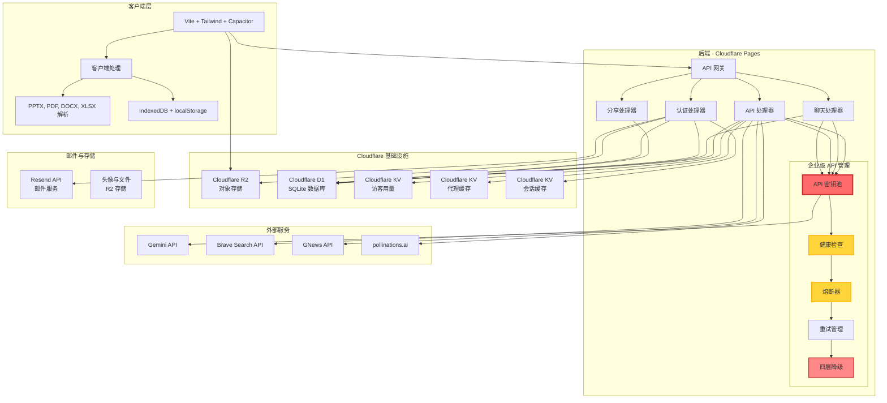

<div align="center">


# LittleAIBox

**现代化跨平台 AI 对话助手**

[](https://opensource.org/licenses/MIT)
[](https://github.com/diandiancha/LittleAIBox)
[](https://github.com/diandiancha/LittleAIBox)

[中文](README.zh-CN.md) | [English](../README.md) | [日本語](README.ja.md) | [한국어](README.ko.md)

本项目基于 **Google Gemini API** 构建对话功能，提供智能的 AI 交互体验。

</div>

---

> 🎓 本项目为教育和研究目的而开发。

> 💼 商业部署和高级服务由作者独立运营，以确保安全性和可持续性。

---

## 🎯 适用人群

LittleAIBox 非常适合：

- **受限地区用户**：内置服务中转方案，轻松连接您与 Gemini
- **学生和研究人员**：在浏览器中分析论文、演示文稿和文档
- **开发人员**：获取编程帮助、文件上下文、代码解释和技术支持
- **内容创作者**：使用 AI 支持生成和编辑 markdown 内容
- **注重隐私的用户**：所有处理都在本地进行；您完全控制您的数据

---

### 🚀 在线体验

<div align="center">

**立即访问:**  

[](https://ai.littletea.xyz)

</div>

### 💡 为什么选择 LittleAIBox？

**这个项目的与众不同之处：**

| 特性 | LittleAIBox | 其他产品 |
|------|-------------|----------|
| 文件处理 | 📄 PPTX、DOCX、PDF、XLSX 支持 | 有限或仅服务器端处理 |
| 隐私性 | 🔒 客户端处理，无需上传 | 通常需要文件上传 |
| 离线支持 | 📱 完整 PWA，离线可用 | 离线功能有限 |
| 跨平台 | 🌐 Web + PWA + Android 原生 | 通常仅 Web 或移动端 |
| 框架 | ⚡ Vanilla JS，零臃肿 | 通常依赖 React/Vue |
| 区域访问 | 🌍 内置服务中转方案 | 可能受地区限制 |
| **高可用性** | 🛡️ **企业级 API 池**，支持健康检查与自动故障转移 | ❌ 单 API 依赖，易中断 |
| 开源 | ✅ 100% 前端开源 | 各不相同 |
| 成本 | 💰 使用您自己的 API 密钥 | 通常是订阅制 |

**选择 LittleAIBox，如果您需要**：最大隐私、离线优先设计、零框架依赖以及对 AI 对话的完全控制。

### 📱 应用截图

#### 主页面


#### 设置页面


---

## ✨ 核心亮点

### 🎯 **强大的文件处理能力**
- **Office 文档解析**: 直接在浏览器中解析 Word (.docx)、PDF、Excel (.xlsx) 和 **PowerPoint (.pptx)** 文件
- **富媒体支持**: 支持图片和 Markdown 文件
- **完全本地处理**: 所有文件解析均在浏览器端完成，保护隐私安全

### 🔐 **隐私优先设计**
- **无需注册**: 直接使用，无需创建账户即可开始体验
- **自行配置 API Key**: 使用您自己的 Gemini API 密钥，数据完全由您控制
- **灵活存储**: 注册用户的 API 密钥会持久化保存，方便多设备同步；访客用户的密钥仅存储在本地，刷新页面后自动清除，充分保障隐私

### 🌍 **无障碍访问**
- **地区限制解决方案**: 内置服务中转路由，突破地理限制
- **离线优先**: 完整的 PWA 支持，离线也能使用
- **全平台支持**: Web、PWA、Android 原生应用无缝切换

### 💬 **专业级 Markdown 渲染**
- **代码高亮**: 支持 40+ 种编程语言语法高亮
- **数学公式**: 使用 KaTeX 渲染精美数学表达式
- **流程图**: 支持交互式 Mermaid 图表
- **GitHub 风格**: 完整的 GFM 语法支持

### 🌐 **多语言支持**
- **5 种语言**: 中文（简体/繁体）、英语、日语、韩语
- **智能检测**: 根据浏览器设置自动检测语言
- **极速切换**: 智能翻译缓存，语言切换零延迟

### 🎨 **精美界面设计**
- **深色/浅色模式**: 无缝主题切换
- **响应式布局**: 桌面、平板、手机完美适配
- **原生体验**: Capacitor 集成，移动端原生般流畅

### ⚡ **极致性能优化**
- **快速加载**: Vite 构建，代码分割优化
- **智能缓存**: Service Worker 智能缓存策略
- **轻量无依赖**: 纯 JavaScript，无重型框架

### 🛡️ **企业级后端架构**
- **弹性 API 密钥池**: 生产级多密钥轮换与自动负载均衡
- **健康检查与熔断保护**: 实时监控与智能故障转移
- **四层智能降级系统**: 确保服务连续性，故障也能稳定运行
- **高可用性保障**: 自动区域限制绕过，服务永不中断

---

## 🏗️ 技术架构

### 🏗️ 系统架构图



### 🧩 前端技术栈

**核心技术**
- **构建工具**: Vite 7.x
- **框架**: 原生 JavaScript (ES6+ Modules) - 零框架负担
- **样式框架**: Tailwind CSS 4.x
- **移动端**: Capacitor 7.x (支持 Android)

**核心库**
- **Markdown**: marked.js + DOMPurify
- **代码高亮**: highlight.js (40+ 语言)
- **数学渲染**: KaTeX
- **图表**: Mermaid
- **文件解析**: mammoth (Word)、PDF.js、xlsx、pptx2html
- **存储**: IndexedDB + localStorage

### 💾 客户端处理

所有文件解析和处理完全在浏览器端完成：
- **PPTX 解析**: 完整提取 PowerPoint 内容
- **PDF 阅读**: 文本和元数据提取
- **Excel 处理**: 电子表格数据解析
- **图片处理**: 客户端图片处理

### 离线支持

- **Service Worker**: 自定义缓存策略
- **IndexedDB**: 本地聊天记录和设置存储
- **渐进式 Web 应用**: 可安装，离线可用

### 🛡️ 后端架构

本项目的后端基于 **Cloudflare Pages** 构建，采用现代化的无服务器架构。

**为什么后端闭源？**

虽然我致力于透明性，但后端保持闭源有几个重要原因：

1. **安全性**：保护用户数据、API 密钥和身份验证机制
2. **成本控制**：防止 API 密钥滥用，确保服务可持续
3. **基础设施**：保护专有的优化策略和故障转移系统
4. **合规性**：满足地区要求的同时保持服务质量

**什么是透明的？**

- ✅ 所有前端代码开源并采用 MIT 许可证
- ✅ 所有 API 端点公开且有详细文档
- ✅ 您可以检查所有网络请求
- ✅ 客户端处理完全可审计
- ✅ 无隐藏追踪或数据收集

**开发者友好**：前端代码展示了所有后端交互，您可以构建自己的后端或自托管整个堆栈。所有 API 都是公开且稳定的。

#### 核心数据库层

**Cloudflare D1 (SQLite)**
- 完整的用户认证系统（邮箱/密码），支持安全的密码哈希和验证
- JWT 会话管理，实现无状态认证和多设备登录
- 聊天记录持久化存储，支持历史记录查询和恢复
- 用户配置和偏好设置管理

#### 核心：弹性 API 密钥池 (APIKeyPool)

这个系统采用了一个生产级的高可用 API 密钥管理系统：

- **多密钥轮询**: 智能管理多个 Gemini 和 Brave Search API 密钥，自动负载均衡
- **健康检查机制**: 实时监控每个密钥的可用性和响应质量
- **自动故障转移**: 当某个密钥失效或触发限流时，无缝切换到备用密钥
- **熔断保护**: 防止短时间内重复请求失效密钥，保护系统资源
- **智能重试策略**: 指数退避算法，最大化请求成功率

#### 核心：智能降级与回退系统 (Smart Failover)

实现了精心设计的四层智能降级架构，确保高可用性和服务连续性：

1. **用户密钥优先**: 优先使用用户自己配置的 API 密钥
2. **混合模式**: 在用户密钥基础上，智能补充服务器密钥
3. **单密钥模式**: 单一服务器密钥作为备用方案
4. **服务器回退**: 最终保障机制，确保服务永不中断

该系统能够自动检测并绕过地区限制、失效密钥、网络故障等问题，为用户提供持续稳定的服务体验。

#### 集成服务生态

**邮件服务**
- **Resend**: 用于安全的邮箱验证和密码重置流程
- 支持 HTML 模板和国际化邮件内容

**搜索与内容**
- **Brave Search API**: 提供高质量的网络搜索结果，增强 AI 上下文理解
- **GNews API**: 实时新闻资讯集成，支持最新信息查询

**图像生成**
- **pollinations.ai**: 高性能图像生成服务，支持多种艺术风格
- 客户端代理服务，保护用户隐私

**云存储**
- **Cloudflare R2**: S3 兼容的对象存储，用于用户头像和附件存储
- 全球 CDN 加速，低延迟访问
- **Cloudflare KV**: 高性能键值存储，用于缓存、会话管理和用量限制追踪

---

## 📚 文档导航

<div align="center">

**快速访问项目资源**

[](LEARN.zh-CN.md) 
[](CONTRIBUTING.zh-CN.md) 
[](../.github/CODE_OF_CONDUCT.md) 
[](../.github/SECURITY.md)

**📖 [完整文档索引](../docs/)**

</div>

---

## 📁 项目结构

```
LittleAIBox/
├── src/                    # 源代码目录
│   ├── main.js            # 主应用逻辑
│   ├── api-config.js      # API 配置
│   ├── db.js              # IndexedDB 封装
│   ├── i18n.js            # 国际化模块
│   ├── mermaid-renderer.js # 图表渲染
│   ├── style.css          # 全局样式
│   └── sw-custom.js       # Service Worker
├── public/                 # 静态资源
│   ├── locales/           # 翻译文件（5种语言）
│   ├── libs/              # 第三方库
│   ├── images/            # 图片和图标
│   └── manifest.webmanifest # PWA 清单
├── appshow/                # 按语言分类的截图
├── capacitor.config.json   # 移动应用配置
├── vite.config.js          # 构建配置
└── package.json            # 项目依赖
```

---

## 🚀 快速开始

### 📝 使用说明

**使用提示**: 建议您自行配置 Gemini API 密钥以获得更好的使用体验。您无需注册账户，只需在设置页面输入您的 API 密钥即可开始使用。

获取 API 密钥：[Google AI Studio](https://aistudio.google.com/api-keys)

### 环境要求

- Node.js 18+
- npm 或 yarn
- Gemini API 密钥（可选，但推荐以获得最佳体验）

> **注意**：虽然服务可以使用共享 API 密钥，但我强烈建议您使用自己的 API 密钥以获得更好的性能和隐私保护。

### 安装步骤

```bash
# 克隆仓库
git clone https://github.com/diandiancha/LittleAIBox.git
cd LittleAIBox

# 安装依赖
npm install

# 启动开发服务器
npm run dev

# 构建生产版本
npm run build
```

### 配置说明

1. **获取您的 API 密钥**（如果您还没有）：
   - 访问 [Google AI Studio](https://aistudio.google.com/api-keys)
   - 创建新的 API 密钥
   - 复制密钥以供应用使用

2. **在应用中配置**：
   - 打开应用：[LittleAIBox](https://ai.littletea.xyz)
   - 进入设置页面
   - 输入您的 Gemini API 密钥
   - 保存并开始使用！

### 故障排除

**常见问题：**

| 问题 | 解决方案 |
|------|---------|
| API 密钥无法使用 | 确保您的密钥来自 Google AI Studio 且有剩余配额 |
| 文件无法解析 | 检查浏览器控制台是否有错误；确保文件格式受支持 |
| 响应缓慢 | 检查网络连接；考虑使用您自己的 API 密钥 |
| 移动端构建失败 | 确保已安装 Android Studio 并正确配置环境 |

**需要帮助？**
- 查看 [Issues](https://github.com/diandiancha/LittleAIBox/issues) 了解已知问题
- 提交新 issue 并提供问题详情

### 移动端构建

```bash
# 添加 Android 平台
npx cap add android

# 同步文件
npx cap sync

# 在 Android Studio 中打开
npx cap open android
```

---

## 🎯 应用场景

- **学术研究**: 解析和分析研究论文、演示文稿
- **内容创作**: 使用 AI 生成和编辑 Markdown 内容
- **编程辅助**: 获取编程任务帮助和代码解释
- **文档分析**: 从 Office 文档中提取见解
- **学习工具**: 支持文件附件的交互式 AI 辅导

---

## 🤝 参与贡献

欢迎您的贡献！无论是修复 bug、添加功能还是改进文档，每一个贡献都让 LittleAIBox 变得更好。

### 如何贡献

1. **Fork 仓库**并克隆到本地
2. **创建分支**：`git checkout -b feature/your-feature-name`
3. **进行修改**并充分测试
4. **提交修改**：`git commit -m "Add: 您修改的描述"`
5. **推送到您的 fork**：`git push origin feature/your-feature-name`
6. **提交 Pull Request**，并附上清晰的修改说明

### 贡献指南

- 遵循现有代码风格和约定
- 为复杂逻辑添加注释
- 为新功能更新文档
- 编写清晰的提交信息
- 提交前测试您的修改

### 发展路线

我正在积极开发：

- 🌐 iOS 支持（Capacitor）
- 📊 更多文件格式支持
- 🎨 自定义主题
- 🔌 插件系统
- 🌍 更多语言
- 📱 增强的移动端功能

有想法？[提交 issue](https://github.com/diandiancha/LittleAIBox/issues) 或发起讨论！

---

## 🔒 隐私与安全

- **客户端处理**: 文件解析在您的浏览器中完成
- **本地存储**: 聊天记录本地存储（可选云端同步）
- **无追踪**: 隐私优先的设计理念
- **开源透明**: 代码完全开源，可审计

🧠 **所有处理都在本地或通过您配置的 API 密钥完成 — 未经您同意，数据绝不会离开您的设备。**

---

## 📄 许可证

本项目采用 [MIT License](LICENSE) 许可证。

Copyright (c) 2025 diandiancha

---

<div align="center">

Made with ❤️ by diandiancha

**如果觉得有帮助，请给个 ⭐ Star！**

💬 **有问题或建议？[提交 Issue](https://github.com/diandiancha/LittleAIBox/issues) — 我会认真阅读每一个！**

</div>
